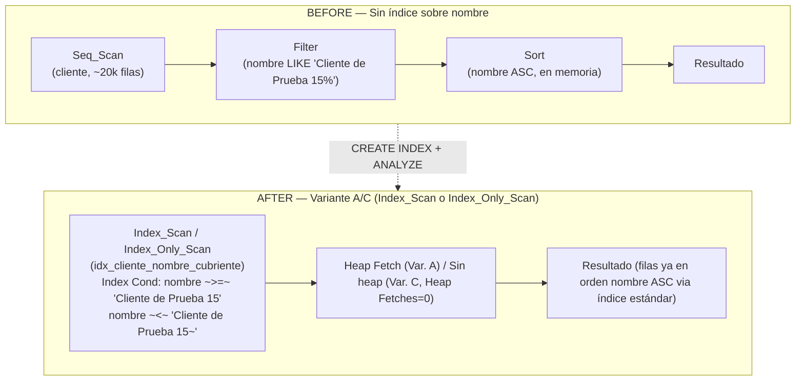
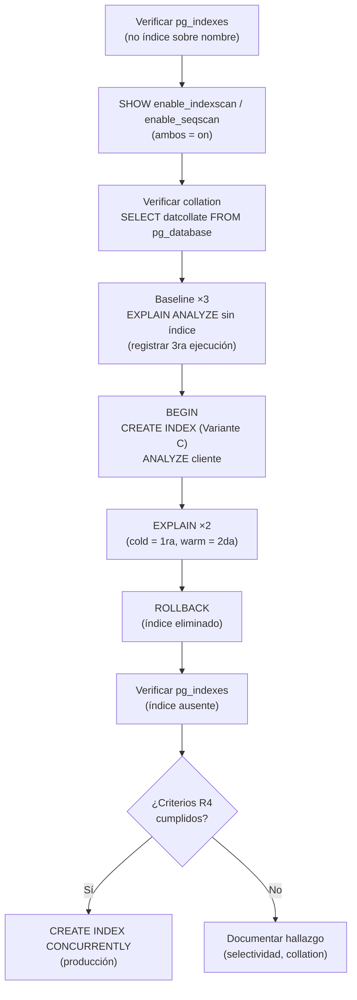

# Documento de Diseño Técnico: Optimización LIKE Prefijado sobre `cliente.nombre`

## Overview

### Problema identificado

La consulta de búsqueda por patrón de texto sobre la tabla `cliente` (~20.000 registros) ejecuta un **Seq_Scan** completo seguido de un **Sort** en memoria:

```sql
SELECT id_cliente, nombre, email, telefono
FROM cliente
WHERE nombre LIKE 'Cliente de Prueba 15%'
ORDER BY nombre;
```

**Causa raíz doble:**
1. No existe ningún índice sobre `nombre`, forzando el Seq_Scan.
2. Aunque existiera un índice B-Tree estándar, el operador `LIKE` sobre columnas `varchar`/`text` con collation distinto de `C` (situación habitual en instalaciones latinoamericanas: `es_AR.UTF-8`, `en_US.UTF-8`) **no puede usar un índice B-Tree normal** para búsquedas de patrón. PostgreSQL requiere la clase de operador `text_pattern_ops` para habilitar el uso del índice con `LIKE` prefijado bajo cualquier collation.

### Por qué LIKE prefijado sí puede usar un índice B-Tree

Un patrón `LIKE 'prefijo%'` (*left-anchored*) puede traducirse en un rango de árbol B:

```
nombre >= 'prefijo'  AND  nombre < 'prefijo' || chr(255)
```

Esta equivalencia de rango permite al B-Tree localizar el primer nodo hoja con `nombre >= 'prefijo'` y recorrer en dirección forward hasta superar el límite superior. La clase `text_pattern_ops` hace que PostgreSQL aplique exactamente este rango byte a byte (sin interferencias del collation).

**Por qué NO funciona con collation != C sin text_pattern_ops:** el collation normal compara caracteres según reglas lingüísticas (acentos, mayúsculas, etc.) que el árbol B no puede usar para el operador `LIKE`. Con `text_pattern_ops`, la comparación es byte a byte (equivalente a collation C), lo que sí es compatible con la transformación de rango.

### Solución propuesta: tres variantes de índice

| Variante | Definición | Nodo esperado | Elimina Sort | Requisito especial |
|----------|-----------|--------------|-------------|-------------------|
| **A** — Pattern ops | `(nombre text_pattern_ops)` | Index_Scan / Bitmap_Index_Scan | No (necesita índice adicional) | Collation != C |
| **B** — Estándar ASC | `(nombre ASC)` | Index_Scan | Sí | Solo con collation C |
| **C** — Cubriente (recomendada) | `(nombre text_pattern_ops) INCLUDE (email, telefono)` | Index_Only_Scan | No (por text_pattern_ops) | VACUUM previo para IOS |

> **Recomendación**: usar la **Variante C** como índice principal en producción, combinada con un segundo índice estándar si se requiere eliminar Sort en sistemas con collation != C. En entornos educativos (collation C/POSIX), la Variante B cubre ambos requisitos.

---

## Architecture

### Diagrama 1 — Planes de ejecución BEFORE / AFTER



### Diagrama 2 — Flujo del experimento de validación



---

## Components and Interfaces

### 1. Variante A — Índice simple con text_pattern_ops

```sql
CREATE INDEX idx_cliente_nombre_pattern
ON cliente (nombre text_pattern_ops);
```

**Cuándo usar:** base de datos con collation != C y solo se necesita habilitar `LIKE` prefijado. Para eliminar el Sort adicionalmente, crear también un índice estándar `ON cliente (nombre ASC)` (el Optimizador usa cada uno para lo que puede).

**Limitación:** `text_pattern_ops` usa comparación byte a byte; el índice **no** puede satisfacer `ORDER BY nombre` con el collation habitual (el Optimizador no lo usa para ordenamiento con collation lingüístico). El Sort persiste.

---

### 2. Variante B — Índice estándar ASC (collation C)

```sql
CREATE INDEX idx_cliente_nombre_asc
ON cliente (nombre ASC);
```

**Cuándo usar:** la base de datos fue creada con `LC_COLLATE=C` o `POSIX`. En ese caso, un índice B-Tree estándar soporta **tanto** `LIKE` prefijado como `ORDER BY nombre ASC`, resolviendo ambos cuellos de botella con un solo índice.

**Cómo verificar el collation:**
```sql
SELECT datname, datcollate FROM pg_database WHERE datname = current_database();
```

---

### 3. Variante C — Índice cubriente (recomendada para producción)

```sql
CREATE INDEX idx_cliente_nombre_cubriente
ON cliente (nombre text_pattern_ops)
INCLUDE (email, telefono);
```

**Por qué cubre el SELECT completo:**

| Columna en SELECT | Fuente en el índice cubriente |
|------------------|-------------------------------|
| `nombre` | Columna clave del índice |
| `email` | Columna `INCLUDE` (almacenada en hoja) |
| `telefono` | Columna `INCLUDE` (almacenada en hoja) |
| `id_cliente` | PK BIGINT, implícita en cada entrada de hoja del B-Tree |

Con `VACUUM cliente` previo (para poblar el visibility map), el Optimizador puede seleccionar **Index_Only_Scan** con `Heap Fetches: 0`.

---

### 4. Script `cliente_like_experiment.sql`

El script consolida todos los bloques del experimento:

**Bloque 0 — Estado inicial del catálogo:**
```sql
SELECT indexname, indexdef FROM pg_indexes WHERE tablename = 'cliente';
-- Confirmar ausencia de índice sobre nombre.
```

**Bloque A — Parámetros del planificador:**
```sql
SHOW enable_indexscan;
SHOW enable_seqscan;
-- Ambos deben retornar 'on'.
```

**Bloque B — Verificación del collation:**
```sql
SELECT datname, datcollate, datctype
FROM pg_database
WHERE datname = current_database();
-- Si datcollate != 'C' o 'POSIX' → usar text_pattern_ops.
```

**Bloque C — Baseline (3 ejecuciones, registrar 3ra):**
```sql
EXPLAIN (ANALYZE, BUFFERS, FORMAT TEXT)
SELECT id_cliente, nombre, email, telefono
FROM cliente
WHERE nombre LIKE 'Cliente de Prueba 15%'
ORDER BY nombre;
```

**Bloque D — Experimento transaccional con ROLLBACK:**
```sql
BEGIN;
    CREATE INDEX idx_cliente_nombre_cubriente
    ON cliente (nombre text_pattern_ops)
    INCLUDE (email, telefono);

    ANALYZE cliente;

    -- Cold cache (1ra ejecución post-índice):
    EXPLAIN (ANALYZE, BUFFERS, FORMAT TEXT)
    SELECT id_cliente, nombre, email, telefono
    FROM cliente
    WHERE nombre LIKE 'Cliente de Prueba 15%'
    ORDER BY nombre;

    -- Warm cache (2da ejecución post-índice):
    EXPLAIN (ANALYZE, BUFFERS, FORMAT TEXT)
    SELECT id_cliente, nombre, email, telefono
    FROM cliente
    WHERE nombre LIKE 'Cliente de Prueba 15%'
    ORDER BY nombre;
ROLLBACK;
```

**Bloque E — Verificación post-ROLLBACK:**
```sql
SELECT indexname, indexdef FROM pg_indexes WHERE tablename = 'cliente';
-- idx_cliente_nombre_cubriente no debe aparecer.
```

**Bloque F — Promoción a producción (condicional, comentado):**
```sql
-- Solo descomentar si todos los criterios R4.1-R4.6 se cumplen:
-- CREATE INDEX CONCURRENTLY idx_cliente_nombre_cubriente
-- ON cliente (nombre text_pattern_ops)
-- INCLUDE (email, telefono);
```

---

## Data Models

### Estructura interna del índice con text_pattern_ops

Las entradas de hoja del B-Tree tienen la forma:

```
Variante A:
( nombre [bytes, text_pattern_ops]  |  tid )

Variante C (cubriente):
( nombre [bytes, text_pattern_ops]  |  email  |  telefono  |  tid )
  ────────────────────────────────    ───────   ─────────    ──────
  clave de búsqueda (pattern ops)    INCLUDE    INCLUDE       heap ptr
```

### Cómo LIKE 'prefijo%' se traduce en rango B-Tree

Con `text_pattern_ops`, PostgreSQL convierte el predicado LIKE en dos condiciones de rango byte a byte:

```
WHERE nombre ~>=~ 'Cliente de Prueba 15'
  AND nombre  ~<~  'Cliente de Prueba 16'   -- siguiente prefijo byte a byte
```

Los operadores `~>=~` y `~<~` son los operadores de comparación de `text_pattern_ops`. El Optimizador los usa para ubicar el límite inferior en el árbol y recorrer en dirección forward hasta superar el límite superior.

```
Páginas hoja (orden byte a byte, text_pattern_ops):
... | 'Cliente de Prueba 149' | 'Cliente de Prueba 15' | 'Cliente de Prueba 150' | ...
                                        ↑                              ↑
                                  límite inferior                 límite superior
                               (>= 'Cliente de Prueba 15')    (< 'Cliente de Prueba 16')
```

### Nota sobre Sort y text_pattern_ops

Con `text_pattern_ops`, el índice ordena byte a byte (equivalente a collation C), **no** según el collation lingüístico de la base de datos. Si el collation es, por ejemplo, `es_AR.UTF-8`, el orden del índice puede diferir del orden que el Optimizador necesita para satisfacer `ORDER BY nombre` con ese collation. Por eso el Optimizador puede mantener el nodo Sort incluso con el índice presente. Soluciones:

| Situación | Solución |
|-----------|----------|
| Collation C/POSIX | Usar índice estándar: `ON cliente (nombre ASC)` — satisface LIKE y ORDER BY |
| Collation != C | Usar `text_pattern_ops` para LIKE + índice estándar separado para ORDER BY, o aceptar Sort |
| Máxima cobertura | `text_pattern_ops` + INCLUDE habilita Index_Only_Scan; el Sort puede permanecer pero el costo baja por acceso directo |

### Tabla comparativa de variantes

| Aspecto | Variante A | Variante B | Variante C |
|---------|-----------|-----------|-----------|
| Clase operador | `text_pattern_ops` | Ninguna (estándar) | `text_pattern_ops` |
| Collation compatible | Cualquiera | Solo C/POSIX | Cualquiera |
| Soporta `LIKE` prefijado | Sí | Sí (solo C) | Sí |
| Elimina Sort | No | Sí (solo C) | No (text_pattern_ops) |
| Columnas INCLUDE | No | No | `email`, `telefono` |
| Tipo nodo esperado | Index_Scan | Index_Scan | Index_Only_Scan |
| Heap Fetches | N | N | 0 (con VACUUM) |
| Tamaño estimado | ~1 MB | ~1 MB | ~2 MB |
| Caso óptimo | LIKE en collation != C | LIKE + ORDER BY en collation C | Máxima cobertura, collation != C |

---

## Error Handling

### Caso 1 — Índice creado sin text_pattern_ops con collation != C

**Condición:** se crea `ON cliente (nombre ASC)` en una BD con `datcollate = 'es_AR.UTF-8'`.

**Efecto:** el Optimizador **ignora** el índice para el predicado `LIKE` porque el B-Tree estándar con collation lingüístico no puede resolver comparaciones de patrón. El plan mantiene Seq_Scan.

**Detección:**
```sql
SELECT datcollate FROM pg_database WHERE datname = current_database();
-- Resultado != 'C' → requiere text_pattern_ops
```

**Acción:** eliminar el índice y recrearlo con `text_pattern_ops`:
```sql
DROP INDEX idx_cliente_nombre_asc;
CREATE INDEX idx_cliente_nombre_cubriente ON cliente (nombre text_pattern_ops) INCLUDE (email, telefono);
ANALYZE cliente;
```

---

### Caso 2 — ANALYZE no ejecutado tras CREATE INDEX

**Efecto:** estadísticas desactualizadas → estimaciones incorrectas → plan subóptimo.

**Acción:** siempre ejecutar `ANALYZE cliente` inmediatamente después de `CREATE INDEX` dentro del bloque `BEGIN … ROLLBACK`.

---

### Caso 3 — VACUUM no ejecutado antes de probar Variante C

**Efecto:** visibility map incompleto → Index_Only_Scan degrada a Index_Scan con Heap Fetches > 0.

**Acción:** ejecutar `VACUUM cliente;` antes del bloque transaccional al probar la Variante C.

---

### Caso 4 — Sort persiste con text_pattern_ops (comportamiento esperado)

**Condición:** índice creado con `text_pattern_ops` en BD con collation != C.

**Efecto:** el Sort en `ORDER BY nombre` puede persistir porque el orden byte a byte del índice difiere del orden lingüístico del collation.

**Acción:** este es el comportamiento esperado y correcto. Documentarlo. Si se necesita eliminar el Sort, crear adicionalmente `ON cliente (nombre ASC)` (sin `text_pattern_ops`) para que el Optimizador use uno para el filtro LIKE y otro para el ordenamiento.

---

### Caso 5 — Parámetros enable_seqscan/enable_indexscan desactivados

**Efecto:** resultados de EXPLAIN ANALYZE no reflejan el comportamiento real del Optimizador. Experimento invalidado.

**Acción:** `SET enable_seqscan = on; SET enable_indexscan = on;` y reiniciar desde Bloque 0.

---

## Testing Strategy

### Protocolo de validación (8 pasos)

**Paso 1 — Verificar estado del catálogo:**
```sql
SELECT indexname, indexdef FROM pg_indexes WHERE tablename = 'cliente';
```
*Criterio:* ninguna entrada con `nombre` en `indexdef`.

**Paso 2 — Verificar parámetros del planificador:**
```sql
SHOW enable_indexscan; SHOW enable_seqscan;
```
*Criterio:* ambos `on`.

**Paso 3 — Verificar collation:**
```sql
SELECT datname, datcollate, datctype FROM pg_database WHERE datname = current_database();
```
*Criterio:* registrar `datcollate`. Si != `C` → usar `text_pattern_ops` (Variante C).

**Paso 4 — Medir baseline (3 ejecuciones, registrar 3ra):**
```sql
EXPLAIN (ANALYZE, BUFFERS, FORMAT TEXT)
SELECT id_cliente, nombre, email, telefono
FROM cliente
WHERE nombre LIKE 'Cliente de Prueba 15%'
ORDER BY nombre;
```

**Paso 5 — Bloque transaccional (Variante C):**
```sql
BEGIN;
    CREATE INDEX idx_cliente_nombre_cubriente
    ON cliente (nombre text_pattern_ops)
    INCLUDE (email, telefono);
    ANALYZE cliente;
    -- Cold:
    EXPLAIN (ANALYZE, BUFFERS, FORMAT TEXT)
    SELECT id_cliente, nombre, email, telefono FROM cliente
    WHERE nombre LIKE 'Cliente de Prueba 15%' ORDER BY nombre;
    -- Warm:
    EXPLAIN (ANALYZE, BUFFERS, FORMAT TEXT)
    SELECT id_cliente, nombre, email, telefono FROM cliente
    WHERE nombre LIKE 'Cliente de Prueba 15%' ORDER BY nombre;
ROLLBACK;
```

**Paso 6 — Verificar eliminación del índice post-ROLLBACK:**
```sql
SELECT indexname, indexdef FROM pg_indexes WHERE tablename = 'cliente';
```

**Paso 7 — Tabla comparativa y checklist:**

| Métrica | Baseline (3ra) | Post-índice cold | Post-índice warm |
|---------|---------------|-----------------|-----------------|
| Nodo acceso | Seq_Scan | ? | ? |
| Sort presente | Sí | ? | ? |
| Execution Time (ms) | X | ? | ? |
| Shared Hit (índice) | 0 | ? | ? |
| Heap blocks leídos | N | ? | ? |
| Heap Fetches | N/A | ? | ? |

| Criterio | Verificación | ¿Cumplido? |
|----------|-------------|-----------|
| R4.1 — Reemplazo Seq_Scan | Index_Scan / Bitmap_Index_Scan / Index_Only_Scan | ? |
| R4.2 — Sort eliminado | Ausencia de nodo Sort | ? |
| R4.3 — Reducción ≥ 20% | (baseline_ms - warm_ms) / baseline_ms >= 0.20 | ? |
| R4.4 — Shared hit > 0 + heap < baseline | BUFFERS | ? |
| R4.5 — Seq_Scan persistente | Verificar collation y text_pattern_ops | N/A |

**Paso 8 — [Condicional] CREATE INDEX CONCURRENTLY para producción:**
```sql
-- Solo si todos R4.1-R4.6 se cumplen, fuera de BEGIN/COMMIT:
CREATE INDEX CONCURRENTLY idx_cliente_nombre_cubriente
ON cliente (nombre text_pattern_ops)
INCLUDE (email, telefono);
```

### Nota sobre Property-Based Testing

Esta feature es optimización DDL/observacional pura. No existe lógica de aplicación propia sobre la cual formular propiedades universales. La estrategia es experimental: medición cuantitativa de métricas del planificador bajo condiciones controladas.
