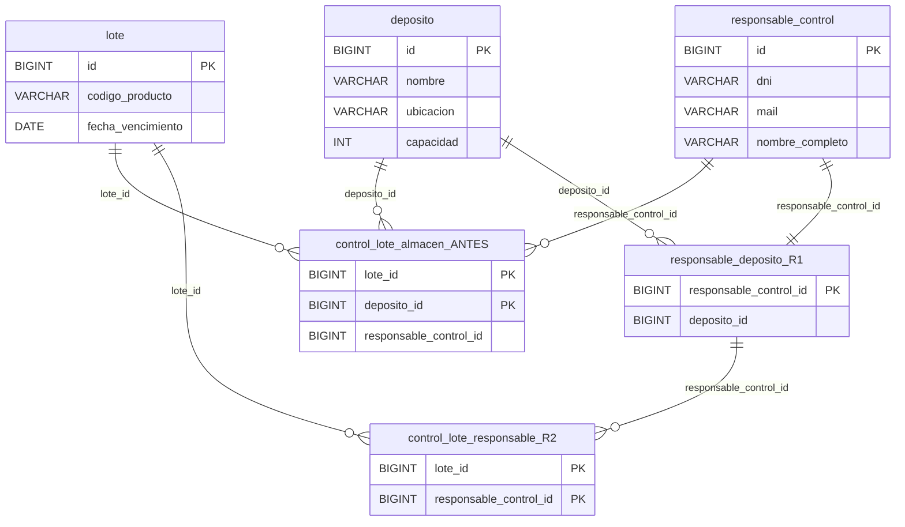
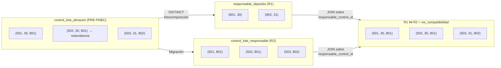
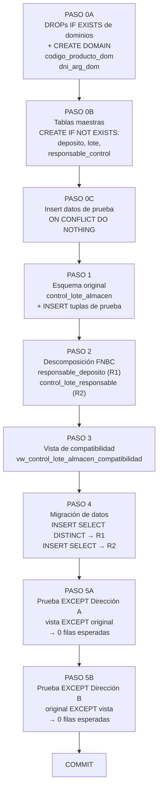

# Design Document — FNBC: Control de Lote en Almacén

## Overview

### Problema identificado

La relación `control_lote_almacen(lote_id, deposito_id, responsable_control_id)` con PK compuesta `{lote_id, deposito_id}` concentra dos hechos semánticamente independientes:

1. **¿Qué responsable audita qué lote en qué depósito?** — hecho correcto de la relación.
2. **¿A qué depósito pertenece cada responsable?** — hecho independiente que no depende del lote.

El segundo hecho genera la dependencia funcional **DF2: R → D** (`responsable_control_id → deposito_id`), cuyo determinante R no es superclave. Esto viola FNBC y produce:

- **Redundancia estructural:** el par `(responsable=801, deposito=30)` se repite en cada fila donde aparece ese responsable.
- **Anomalía de actualización:** cambiar el depósito de un responsable exige modificar múltiples filas; una actualización parcial deja la base en estado inconsistente.
- **Anomalía de eliminación:** eliminar el último lote auditado por un responsable destruye también el hecho "ese responsable pertenece a ese depósito".

### Solución propuesta

Aplicar el **Teorema de Heath** sobre DF2 para descomponer la relación en dos esquemas en FNBC:

| Relación | Atributos | PK | DF aislada |
|---|---|---|---|
| **R1** `responsable_deposito` | (R, D) | R | R → D |
| **R2** `control_lote_responsable` | (L, R) | {L, R} | — |

La reunión natural R1 ⋈ R2 sobre R reconstruye exactamente la instancia original (propiedad lossless-join). La vista `vw_control_lote_almacen_compatibilidad` materializa esa reunión para compatibilidad hacia atrás.

---

## Architecture

### Diagrama 1 — Estado ANTES y DESPUÉS de la descomposición



### Diagrama 2 — Instancia de ejemplo y reconstrucción lossless-join



### Diagrama 3 — Flujo de ejecución del script DDL



---

## Components and Interfaces

### 1. Dominios PostgreSQL reutilizables

#### `codigo_producto_dom`

```sql
CREATE DOMAIN codigo_producto_dom AS VARCHAR(50)
    CONSTRAINT ck_codigo_producto_formato
        CHECK (VALUE ~ '^[A-Z0-9][A-Z0-9\-]{1,48}[A-Z0-9]$');
```

Valida que el código de producto tenga formato estructurado: mayúsculas, dígitos y guiones internos. Ejemplos válidos: `PROD-01`, `ABC-123`. Rechaza minúsculas, guiones al inicio/fin y cadenas vacías. Al ser un dominio, cualquier tabla futura que lo use hereda la validación sin repetir el `CHECK`.

#### `dni_arg_dom`

```sql
CREATE DOMAIN dni_arg_dom AS VARCHAR(20)
    CONSTRAINT ck_dni_arg_formato
        CHECK (VALUE ~ '^\d{7,8}$');
```

Restringe el DNI argentino a exactamente 7 u 8 dígitos numéricos. Rechaza letras, puntos y espacios.

---

### 2. Tablas maestras (Paso 0)

#### `deposito`

```sql
CREATE TABLE IF NOT EXISTS deposito (
    id        BIGINT        PRIMARY KEY,
    nombre    VARCHAR(100)  NOT NULL,
    ubicacion VARCHAR(255)  NOT NULL,
    capacidad INT           NOT NULL
        CONSTRAINT chk_deposito_capacidad CHECK (capacidad > 0)
);
```

`CHECK (capacidad > 0)` descarta valores nulos o negativos que no tienen sentido físico para un almacén.

#### `lote`

```sql
CREATE TABLE IF NOT EXISTS lote (
    id                 BIGINT                PRIMARY KEY,
    codigo_producto    codigo_producto_dom   NOT NULL,
    fecha_vencimiento  DATE                  NOT NULL
        CONSTRAINT chk_lote_vencimiento CHECK (fecha_vencimiento >= CURRENT_DATE)
);
```

Usa el dominio `codigo_producto_dom` para validar el formato del código. `fecha_vencimiento` es `DATE` (no `TIMESTAMPTZ`) porque la caducidad legal de un alimento se expresa siempre como día calendario. El `CHECK` impide registrar lotes ya vencidos al momento de la inserción.

#### `responsable_control`

```sql
CREATE TABLE IF NOT EXISTS responsable_control (
    id              BIGINT        PRIMARY KEY,
    dni             dni_arg_dom   NOT NULL UNIQUE,
    mail            VARCHAR(100)  NOT NULL
        CONSTRAINT chk_responsable_mail
            CHECK (mail ~ '^[^@\s]+@[^@\s]+\.[^@\s]+$'),
    nombre_completo VARCHAR(150)  NOT NULL
);
```

`dni` usa el dominio `dni_arg_dom`. El `CHECK` sobre `mail` garantiza formato mínimo de dirección de correo.

---

### 3. Esquema original defectuoso (Paso 1)

#### `control_lote_almacen`

```sql
CREATE TABLE IF NOT EXISTS control_lote_almacen (
    lote_id                 BIGINT  NOT NULL REFERENCES lote(id),
    deposito_id             BIGINT  NOT NULL REFERENCES deposito(id),
    responsable_control_id  BIGINT  NOT NULL REFERENCES responsable_control(id),
    PRIMARY KEY (lote_id, deposito_id)
);
```

Esta tabla es el punto de partida del análisis. Se mantiene en el script porque es el sujeto de la descomposición y sirve como oráculo en la prueba lossless-join del Paso 5.

---

### 4. Tablas descompuestas en FNBC (Paso 2)

#### R1: `responsable_deposito`

```sql
CREATE TABLE IF NOT EXISTS responsable_deposito (
    responsable_control_id  BIGINT  PRIMARY KEY
        REFERENCES responsable_control(id),
    deposito_id             BIGINT  NOT NULL
        REFERENCES deposito(id)
);
```

Aisla la DF problemática R → D. La PK es `responsable_control_id` (el determinante de DF2), lo que garantiza que cada responsable tenga exactamente un depósito asignado.

#### R2: `control_lote_responsable`

```sql
CREATE TABLE IF NOT EXISTS control_lote_responsable (
    lote_id                 BIGINT  NOT NULL REFERENCES lote(id),
    responsable_control_id  BIGINT  NOT NULL
        REFERENCES responsable_deposito(responsable_control_id),
    PRIMARY KEY (lote_id, responsable_control_id)
);
```

La FK de R2 apunta a `responsable_deposito(responsable_control_id)` en lugar de a `responsable_control(id)` directamente. Esto es intencional: garantiza que solo se puedan registrar responsables cuya asignación de depósito ya existe en R1, lo que hace posible la reunión sin pérdida.

---

### 5. Vista de compatibilidad (Paso 3)

#### `vw_control_lote_almacen_compatibilidad`

```sql
CREATE OR REPLACE VIEW vw_control_lote_almacen_compatibilidad AS
SELECT
    clr.lote_id,
    rd.deposito_id,
    clr.responsable_control_id
FROM control_lote_responsable  clr
JOIN responsable_deposito       rd
    ON clr.responsable_control_id = rd.responsable_control_id;
```

Reconstituye la proyección `(lote_id, deposito_id, responsable_control_id)` mediante la reunión natural de R1 y R2 sobre `responsable_control_id`. Esta es exactamente la operación inversa de la descomposición por Teorema de Heath.

---

## Data Models

### Análisis formal de dependencias funcionales

Dado el esquema `control_lote_almacen(L, D, R)` con los atributos:

- **L** = `lote_id`
- **D** = `deposito_id`
- **R** = `responsable_control_id`

#### Conjunto de DFs del esquema original

| Etiqueta | Dependencia funcional | Determinante es superclave | Satisface FNBC |
|---|---|---|---|
| DF1 | {L, D} → R | Sí ({L,D} es PK) | ✓ Sí |
| DF2 | R → D | No (R no determina L) | ✗ **No** |

#### Prueba de violación de FNBC para DF2

```
Condición FNBC: para toda DF X → Y (no trivial), X debe ser superclave.

DF2: R → D
  - X = {R} = {responsable_control_id}
  - Y = {D} = {deposito_id}
  - ¿Es X superclave? → X⁺ = {R, D}  (cerradura de R bajo F)
  - X⁺ ≠ {L, D, R}  →  X NO es superclave
  ∴ DF2 viola FNBC. ✗
```

#### Aplicación del Teorema de Heath

```
R(L, D, R) con DF2: R → D

Heath: R se descompone sin pérdida en:
  R1 = π{R,D}(R)  →  responsable_deposito(R, D)
  R2 = π{L,R}(R)  →  control_lote_responsable(L, R)

Verificación: R1 ⋈ R2 = R  (atributo de reunión = R, determinante de DF2)
```

### Instancia de ejemplo y trazabilidad

| Paso | Relación | Tuplas |
|---|---|---|
| Original | `control_lote_almacen` | (501,30,801), (502,30,801), (503,31,802) |
| Migración a R1 | `responsable_deposito` | (801,30), (802,31) — DISTINCT elimina duplicado |
| Migración a R2 | `control_lote_responsable` | (501,801), (502,801), (503,802) |
| Reunión R1⋈R2 | `vw_compatibilidad` | (501,30,801), (502,30,801), (503,31,802) ✓ |

### Tabla de dominios completa

| Tabla / Objeto | Atributo | Tipo PostgreSQL | Restricciones | Justificación |
|---|---|---|---|---|
| **DOMINIO** `codigo_producto_dom` | — | `VARCHAR(50)` | `CHECK (VALUE ~ '^[A-Z0-9][A-Z0-9\-]{1,48}[A-Z0-9]$')` | Formato estructurado reutilizable. Centraliza la regla de validación. |
| **DOMINIO** `dni_arg_dom` | — | `VARCHAR(20)` | `CHECK (VALUE ~ '^\d{7,8}$')` | DNI argentino: 7-8 dígitos numéricos. |
| `deposito` | `id` | `BIGINT` | `PRIMARY KEY` | Identificador surrogate; rango amplio para evitar desbordamiento. |
| `deposito` | `nombre` | `VARCHAR(100)` | `NOT NULL` | Nombre descriptivo del almacén. |
| `deposito` | `ubicacion` | `VARCHAR(255)` | `NOT NULL` | Dirección o localidad; longitud suficiente para descripciones largas. |
| `deposito` | `capacidad` | `INT` | `NOT NULL`, `CHECK (capacidad > 0)` | Unidades enteras. Cero o negativo carece de sentido físico. |
| `lote` | `id` | `BIGINT` | `PRIMARY KEY` | Identificador surrogate. |
| `lote` | `codigo_producto` | `codigo_producto_dom` | `NOT NULL` | Hereda validación de formato del dominio. |
| `lote` | `fecha_vencimiento` | `DATE` | `NOT NULL`, `CHECK (fecha_vencimiento >= CURRENT_DATE)` | Caducidad legal expresada como día calendario. Impide registrar lotes ya vencidos. |
| `responsable_control` | `id` | `BIGINT` | `PRIMARY KEY` | Identificador surrogate. |
| `responsable_control` | `dni` | `dni_arg_dom` | `NOT NULL`, `UNIQUE` | Clave candidata. Hereda validación del dominio. |
| `responsable_control` | `mail` | `VARCHAR(100)` | `NOT NULL`, `CHECK (mail ~ '^[^@\s]+@[^@\s]+\.[^@\s]+$')` | Formato mínimo de email: carácter@dominio.tld. |
| `responsable_control` | `nombre_completo` | `VARCHAR(150)` | `NOT NULL` | Mayor longitud por incluir nombre y apellido. |
| `control_lote_almacen` | `lote_id` | `BIGINT` | `NOT NULL`, `FK → lote(id)`, parte de PK | Referencia al lote controlado. |
| `control_lote_almacen` | `deposito_id` | `BIGINT` | `NOT NULL`, `FK → deposito(id)`, parte de PK | Referencia al depósito de control. |
| `control_lote_almacen` | `responsable_control_id` | `BIGINT` | `NOT NULL`, `FK → responsable_control(id)` | Responsable asignado. Su DF con `deposito_id` viola FNBC. |
| `responsable_deposito` (R1) | `responsable_control_id` | `BIGINT` | `PRIMARY KEY`, `FK → responsable_control(id)` | Determinante de DF2 aislada. Un responsable → un depósito. |
| `responsable_deposito` (R1) | `deposito_id` | `BIGINT` | `NOT NULL`, `FK → deposito(id)` | Determinado de DF2 aislada. |
| `control_lote_responsable` (R2) | `lote_id` | `BIGINT` | `NOT NULL`, `FK → lote(id)`, parte de PK | Referencia al lote. |
| `control_lote_responsable` (R2) | `responsable_control_id` | `BIGINT` | `NOT NULL`, `FK → responsable_deposito(responsable_control_id)`, parte de PK | FK a R1 (no a `responsable_control` directamente) para garantizar reunión sin pérdida. |

---

## Error Handling

### Caso 1 — Inserción de lote con fecha de vencimiento pasada

**Condición:** se intenta insertar un lote con `fecha_vencimiento < CURRENT_DATE`.

**Consecuencia:** el `CHECK (fecha_vencimiento >= CURRENT_DATE)` en `lote` rechaza la inserción con un error de violación de restricción.

**Acción en el script de prueba:** las fechas de prueba están fijadas en 2027, garantizando que siempre sean futuras al momento de ejecución. Si se reutiliza el script en el futuro, actualizar las fechas de prueba.

---

### Caso 2 — Inserción en R2 sin registro previo en R1

**Condición:** se intenta insertar en `control_lote_responsable` un `responsable_control_id` que no existe en `responsable_deposito`.

**Consecuencia:** la FK `REFERENCES responsable_deposito(responsable_control_id)` rechaza la inserción con error de violación de llave foránea.

**Acción:** siempre poblar R1 (`responsable_deposito`) antes de poblar R2. El script garantiza este orden en los Pasos 4.

---

### Caso 3 — Prueba EXCEPT devuelve filas

**Condición:** una de las dos direcciones de la prueba `EXCEPT` del Paso 5 devuelve al menos una fila.

**Consecuencia:** la descomposición no es lossless-join. Puede deberse a un JOIN incorrecto en la vista (Dirección A produce tuplas espurias) o a una migración incompleta (Dirección B pierde tuplas).

**Acción:** revisar la cláusula `ON` del JOIN en `vw_control_lote_almacen_compatibilidad` y verificar que los `INSERT ... SELECT` del Paso 4 migraron todas las filas de `control_lote_almacen`.

---

### Caso 4 — Código de producto en minúsculas

**Condición:** se intenta insertar `'prod-01'` como `codigo_producto`.

**Consecuencia:** el dominio `codigo_producto_dom` rechaza la inserción porque el regex `^[A-Z0-9]…` no permite minúsculas.

**Acción:** convertir siempre el código a mayúsculas antes de insertar: `UPPER('prod-01') → 'PROD-01'`.

---

## Testing Strategy

La estrategia de verificación es experimental/declarativa mediante SQL puro. No existe código de aplicación a testear unitariamente.

### Prueba 1 — Verificación de tablas creadas

```sql
SELECT table_name
FROM   information_schema.tables
WHERE  table_schema = 'public'
  AND  table_name IN (
       'deposito', 'lote', 'responsable_control',
       'control_lote_almacen',
       'responsable_deposito', 'control_lote_responsable'
  )
ORDER BY table_name;
-- Resultado esperado: 6 filas
```

### Prueba 2 — Verificación de dominios creados

```sql
SELECT domain_name, data_type, character_maximum_length
FROM   information_schema.domains
WHERE  domain_schema = 'public'
  AND  domain_name IN ('codigo_producto_dom', 'dni_arg_dom')
ORDER BY domain_name;
-- Resultado esperado: 2 filas
```

### Prueba 3 — Verificación de datos migrados en R1

```sql
SELECT * FROM responsable_deposito ORDER BY responsable_control_id;
-- Resultado esperado:
--  responsable_control_id | deposito_id
-- ------------------------+-------------
--                     801 |          30
--                     802 |          31
```

### Prueba 4 — Verificación de datos migrados en R2

```sql
SELECT * FROM control_lote_responsable ORDER BY lote_id;
-- Resultado esperado:
--  lote_id | responsable_control_id
-- ---------+-----------------------
--      501 |                    801
--      502 |                    801
--      503 |                    802
```

### Prueba 5 — Reunión sin pérdida (lossless-join)

```sql
-- Dirección A: 0 filas → sin tuplas espurias
SELECT lote_id, deposito_id, responsable_control_id
FROM   vw_control_lote_almacen_compatibilidad
EXCEPT
SELECT lote_id, deposito_id, responsable_control_id
FROM   control_lote_almacen;

-- Dirección B: 0 filas → sin pérdida de tuplas
SELECT lote_id, deposito_id, responsable_control_id
FROM   control_lote_almacen
EXCEPT
SELECT lote_id, deposito_id, responsable_control_id
FROM   vw_control_lote_almacen_compatibilidad;
```

### Prueba 6 — Rechazo de código de producto inválido

```sql
-- Debe fallar por violación del dominio codigo_producto_dom
BEGIN;
    INSERT INTO lote (id, codigo_producto, fecha_vencimiento)
    VALUES (999, 'prod-01', '2027-01-01');
ROLLBACK;
-- Resultado esperado: ERROR — violación de restricción CHECK ck_codigo_producto_formato
```

### Prueba 7 — Rechazo de DNI con formato incorrecto

```sql
-- Debe fallar por violación del dominio dni_arg_dom
BEGIN;
    INSERT INTO responsable_control (id, dni, mail, nombre_completo)
    VALUES (999, '30.111.222', 'test@test.com', 'Test User');
ROLLBACK;
-- Resultado esperado: ERROR — violación de restricción CHECK ck_dni_arg_formato
```
