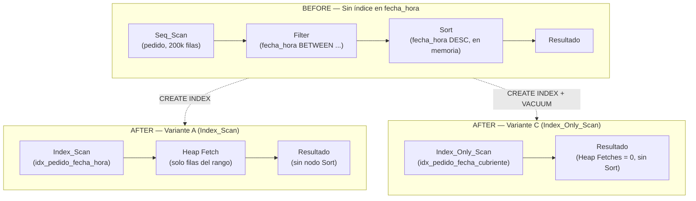
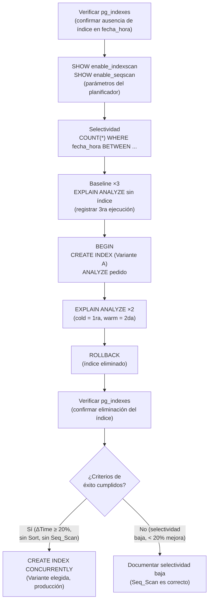

# Design Document

## Overview

### Problema identificado

La consulta objetivo sobre la tabla `pedido` (~200.000 registros) ejecuta un **Sequential Scan (Seq_Scan)** completo seguido de un **Sort en memoria**, dado que no existe ningún índice que cubra el predicado temporal sobre `fecha_hora`:

```sql
SELECT id_pedido, fecha_hora, forma_pago, id_cliente
FROM pedido
WHERE fecha_hora BETWEEN NOW() - INTERVAL '30 days' AND NOW()
ORDER BY fecha_hora DESC;
```

El índice existente `idx_pedido_cliente ON pedido (id_cliente)` **no es apto** para resolver este predicado: su columna líder es `id_cliente`, no `fecha_hora`, por lo que el Optimizador lo descarta correctamente al planificar la consulta objetivo.

### Solución propuesta

Crear un índice **B-Tree** sobre `fecha_hora DESC` en tres variantes incrementales de cobertura:

| Variante | Definición resumida | Tipo de nodo esperado |
|----------|--------------------|-----------------------|
| **A** — Simple | `(fecha_hora DESC)` | Index_Scan |
| **B** — Compuesto | `(fecha_hora DESC, id_cliente)` | Index_Scan |
| **C** — Cubriente | `(fecha_hora DESC) INCLUDE (forma_pago, id_cliente)` | Index_Only_Scan |

### Impacto esperado (plan actual vs. post-índice)

| Aspecto | Plan actual (sin índice) | Plan post-índice (Variante A/C) |
|---------|-------------------------|---------------------------------|
| Nodo de acceso | Seq_Scan (200k filas) | Index_Scan / Index_Only_Scan |
| Nodo Sort | Presente (ordenamiento en memoria) | **Ausente** (el índice ya entrega filas en `DESC`) |
| Filas evaluadas | ~200.000 | Solo las del rango de 30 días |
| Accesos al heap | Todos los bloques de la tabla | Solo bloques del rango (Var. A/B) / Ninguno (Var. C) |
| Heap Fetches | N/A | 0 con Variante C + VACUUM previo |

---

## Architecture

### Diagrama 1 — Planes de ejecución BEFORE / AFTER



### Diagrama 2 — Flujo del experimento de validación



---

## Components and Interfaces

### 1. Variante A — Índice simple `idx_pedido_fecha_hora`

```sql
CREATE INDEX idx_pedido_fecha_hora
    ON pedido (fecha_hora DESC);
```

**Justificación técnica:**
- La dirección `DESC` en la clave del índice hace que las hojas B-Tree ya estén ordenadas de mayor a menor `fecha_hora`. El Optimizador puede recorrer el árbol en orden forward y entregar las filas en `DESC` sin necesidad de un nodo Sort adicional.
- El predicado `BETWEEN NOW() - INTERVAL '30 days' AND NOW()` se traduce directamente en un rango B-Tree: PostgreSQL localiza el límite superior (`<= NOW()`) en el árbol y recorre hacia la derecha hasta el límite inferior (`>= NOW() - 30 days`).
- Para la consulta objetivo, que no filtra por `id_cliente`, esta variante es la más eficiente y ligera en tamaño de índice.

**Cuándo es la variante óptima:** consultas con predicado solo sobre `fecha_hora`, sin filtro adicional de cliente.

---

### 2. Variante B — Índice compuesto `idx_pedido_fecha_cliente`

```sql
CREATE INDEX idx_pedido_fecha_cliente
    ON pedido (fecha_hora DESC, id_cliente);
```

**Justificación técnica:**
- Agrega `id_cliente` como segunda columna de la clave. Permite resolver con un solo recorrido de índice consultas que combinen ambos predicados:
  ```sql
  WHERE fecha_hora BETWEEN ... AND ...
    AND id_cliente = <valor>
  ```
- Para la consulta objetivo (sin `AND id_cliente = ...`) el Optimizador preferirá la Variante A porque el índice compuesto ocupa más espacio y no ofrece beneficio adicional.
- El índice existente `idx_pedido_cliente (id_cliente)` no es equivalente: su columna líder es `id_cliente`, lo que lo hace inútil para el predicado de rango en `fecha_hora`.

**Cuándo es la variante óptima:** consultas que filtran simultáneamente por rango temporal y por cliente específico.

---

### 3. Variante C — Índice cubriente `idx_pedido_fecha_cubriente`

```sql
CREATE INDEX idx_pedido_fecha_cubriente
    ON pedido (fecha_hora DESC)
    INCLUDE (forma_pago, id_cliente);
```

**Por qué cubre completamente el SELECT objetivo:**

La consulta proyecta cuatro columnas: `id_pedido`, `fecha_hora`, `forma_pago`, `id_cliente`.

| Columna en SELECT | Fuente en el índice cubriente |
|------------------|-------------------------------|
| `fecha_hora` | Columna clave del índice |
| `forma_pago` | Columna `INCLUDE` (almacenada en hoja) |
| `id_cliente` | Columna `INCLUDE` (almacenada en hoja) |
| `id_pedido` | Clave primaria BIGINT, implícita en cada entrada de hoja del B-Tree |

Al tener todas las columnas proyectadas disponibles en el índice, PostgreSQL puede ejecutar un **Index_Only_Scan** y evitar completamente los Heap Fetches.

**Requisito previo:** ejecutar `VACUUM pedido` para poblar el **visibility map**. Sin él, PostgreSQL no puede confirmar la visibilidad de cada versión de fila desde el índice y degrada el plan a Index_Scan con Heap Fetches.

**Cuándo es la variante óptima:** cuando se busca la máxima reducción de I/O en la consulta objetivo; implica mayor tamaño de índice por almacenar columnas adicionales en las hojas.

---

### 4. Script `pedido_experiment.sql`

El script de experimentación se estructura en seis bloques secuenciales, diseñados para ejecutarse en orden dentro de una única sesión `psql`:

**Bloque 0 — Verificación de estado inicial (precondición):**
```sql
SELECT indexname, indexdef
FROM   pg_indexes
WHERE  tablename = 'pedido';
-- Confirmar que NO existe ningún índice con columna fecha_hora antes de comenzar.
```

**Bloque A — Verificación de parámetros del planificador:**
```sql
SHOW enable_indexscan;
SHOW enable_seqscan;
-- Ambos deben ser 'on'. Si enable_seqscan = 'off', el experimento está invalidado.
```

**Bloque B — Estimación de selectividad:**
```sql
SELECT COUNT(*)
FROM   pedido
WHERE  fecha_hora BETWEEN NOW() - INTERVAL '30 days' AND NOW();
-- Si el resultado supera el ~20% de 200.000 filas (> 40.000),
-- el Optimizador puede preferir Seq_Scan incluso con índice.
```

**Bloque C — Medición de baseline (sin índice):**
```sql
EXPLAIN (ANALYZE, BUFFERS, FORMAT TEXT)
SELECT id_pedido, fecha_hora, forma_pago, id_cliente
FROM   pedido
WHERE  fecha_hora BETWEEN NOW() - INTERVAL '30 days' AND NOW()
ORDER BY fecha_hora DESC;
-- Ejecutar 3 veces. Registrar la 3ra ejecución (datos en caché, tiempo estabilizado).
```

**Bloque D — Bloque transaccional de prueba:**
```sql
BEGIN;

  CREATE INDEX idx_pedido_fecha_hora
      ON pedido (fecha_hora DESC);

  ANALYZE pedido;

  -- 1ra ejecución post-índice (cold, caché del índice vacío):
  EXPLAIN (ANALYZE, BUFFERS, FORMAT TEXT)
  SELECT id_pedido, fecha_hora, forma_pago, id_cliente
  FROM   pedido
  WHERE  fecha_hora BETWEEN NOW() - INTERVAL '30 days' AND NOW()
  ORDER BY fecha_hora DESC;

  -- 2da ejecución post-índice (warm, índice ya en shared_buffers):
  EXPLAIN (ANALYZE, BUFFERS, FORMAT TEXT)
  SELECT id_pedido, fecha_hora, forma_pago, id_cliente
  FROM   pedido
  WHERE  fecha_hora BETWEEN NOW() - INTERVAL '30 days' AND NOW()
  ORDER BY fecha_hora DESC;

ROLLBACK;
-- El ROLLBACK elimina el índice creado; la tabla queda exactamente como antes.
```

**Bloque E — Verificación post-ROLLBACK:**
```sql
SELECT indexname, indexdef
FROM   pg_indexes
WHERE  tablename = 'pedido';
-- Confirmar que idx_pedido_fecha_hora ya NO aparece en el catálogo.
```

**Bloque F — Creación definitiva (condicional, solo si se cumplen criterios de éxito):**
```sql
-- Solo ejecutar si los criterios R4.1–R4.5 se cumplen.
CREATE INDEX CONCURRENTLY idx_pedido_fecha_hora
    ON pedido (fecha_hora DESC);
-- CONCURRENTLY permite crear el índice sin bloquear escrituras en producción.
```

---

## Data Models

### Estructura interna del B-Tree sobre `fecha_hora DESC`

Un índice B-Tree de PostgreSQL se organiza en tres niveles lógicos de páginas:

```
Página raíz
    └── Páginas internas (nodos intermedios)
            └── Páginas hoja (entradas de índice)
```

Cada **entrada de hoja** para la Variante A tiene la forma:

```
( fecha_hora DESC  |  tid )
  ─────────────────  ──────
  clave de búsqueda  puntero a fila en heap
```

Para la **Variante C** (cubriente), cada entrada de hoja almacena adicionalmente las columnas `INCLUDE`:

```
( fecha_hora DESC  |  forma_pago  |  id_cliente  |  tid )
  ─────────────────  ────────────   ────────────   ──────
  clave de búsqueda  INCLUDE        INCLUDE         puntero a heap
```

La clave primaria `id_pedido` no necesita almacenarse explícitamente: cada entrada de hoja B-Tree en PostgreSQL incluye el `tid` (tuple identifier = block + offset), y desde el heap se recupera `id_pedido` sin Heap Fetch adicional porque el PK BIGINT es el campo de identidad de la fila.

### Cómo el predicado BETWEEN se traduce en recorrido B-Tree

```
Índice con fecha_hora DESC (orden de almacenamiento: más reciente → más antiguo)

Hoja más a la izquierda                        Hoja más a la derecha
[ NOW() + ε ]  [NOW()]  [NOW()-1d] ... [NOW()-30d] ... [NOW()-1y] ... [fecha mínima]
                  ↑                         ↑
           límite superior              límite inferior
           (= NOW())                (= NOW() - 30 days)

Recorrido: el Optimizador ubica NOW() con búsqueda binaria (root → interno → hoja)
           y recorre las páginas en dirección FORWARD del árbol (izquierda → derecha).
           El resultado ya llega en orden DESC sin necesidad de Sort.
```

### Compatibilidad de tipos `TIMESTAMPTZ` y `NOW()`

La columna `fecha_hora` es `TIMESTAMPTZ` y la función `NOW()` devuelve `TIMESTAMPTZ`. Ambos tipos son **idénticos** en PostgreSQL: no se produce ningún CAST implícito ni explícito en el predicado, lo que garantiza que el Optimizador puede usar el índice directamente sin funciones de conversión que lo inhabiliten.

### Tabla comparativa de las tres variantes

| Aspecto | Variante A | Variante B | Variante C |
|---------|-----------|-----------|-----------|
| Definición | `(fecha_hora DESC)` | `(fecha_hora DESC, id_cliente)` | `(fecha_hora DESC) INCLUDE (forma_pago, id_cliente)` |
| Tamaño estimado | ~3–4 MB | ~5–6 MB | ~6–8 MB |
| Columnas en clave | 1 | 2 | 1 |
| Columnas en INCLUDE | Ninguna | Ninguna | 2 (`forma_pago`, `id_cliente`) |
| Tipo de nodo esperado | Index_Scan | Index_Scan | Index_Only_Scan |
| Heap Fetches | N (uno por fila devuelta) | N (uno por fila devuelta) | 0 (con VACUUM previo) |
| Requisito adicional | Ninguno | Ninguno | `VACUUM pedido` antes del test |
| Caso de uso óptimo | Consulta objetivo sin filtro de cliente | Consulta con `AND id_cliente = X` | Máxima reducción de I/O en consulta objetivo |
| Elimina Sort | Sí | Sí | Sí |

---

## Error Handling

### Caso 1 — El Optimizador mantiene Seq_Scan (selectividad baja)

**Condición:** la ventana de 30 días concentra más del ~20% de las 200.000 filas (> 40.000 filas), o los `random_page_cost` configurados hacen que el acceso aleatorio vía índice sea más costoso que el escaneo secuencial.

**Comportamiento:** el Optimizador elige correctamente el Seq_Scan. No es un error del índice ni del experimento.

**Acción:** documentar el valor de selectividad obtenido en el Bloque B y registrar el resultado como "índice técnicamente correcto pero no seleccionado por el Optimizador en este volumen de datos". El experimento concluye con resultado válido aunque no óptimo.

---

### Caso 2 — ANALYZE no ejecutado tras CREATE INDEX

**Condición:** se crea el índice pero no se ejecuta `ANALYZE pedido` dentro del bloque transaccional.

**Consecuencia:** las estadísticas de distribución de `fecha_hora` en `pg_statistic` quedan desactualizadas. El Optimizador puede subestimar o sobreestimar la cardinalidad del rango, eligiendo el plan incorrecto.

**Acción:** siempre ejecutar `ANALYZE pedido` inmediatamente después de `CREATE INDEX` dentro del bloque `BEGIN … ROLLBACK`.

---

### Caso 3 — VACUUM no ejecutado antes de probar Variante C

**Condición:** se crea `idx_pedido_fecha_cubriente` (Variante C) sin ejecutar `VACUUM pedido` previamente.

**Consecuencia:** el **visibility map** de la tabla no está poblado para todos los bloques. PostgreSQL no puede confirmar la visibilidad de las versiones de fila desde el índice y **degrada el plan de Index_Only_Scan a Index_Scan con Heap Fetches**. La métrica `Heap Fetches` mostrará un valor > 0.

**Acción:** ejecutar `VACUUM pedido;` antes del bloque transaccional al probar la Variante C. Si no es posible (en un entorno de prueba con escrituras activas), documentar el resultado como Index_Scan en lugar de Index_Only_Scan.

---

### Caso 4 — Parámetros `enable_seqscan` o `enable_indexscan` desactivados

**Condición:** una sesión anterior ejecutó `SET enable_seqscan = off` o `SET enable_indexscan = off` y no los restauró.

**Consecuencia:** el Optimizador ignora artificialmente uno de los planes, lo que invalida completamente la comparación. Un Index_Scan forzado con `enable_seqscan=off` no refleja el comportamiento real del Optimizador.

**Acción:** verificar ambos parámetros en el Bloque A antes de continuar. Si alguno está en `off`, restaurarlo:

```sql
SET enable_seqscan   = on;
SET enable_indexscan = on;
```

Reiniciar el experimento desde el Bloque B.

---

### Caso 5 — Índice previo sobre `fecha_hora` detectado en `pg_indexes`

**Condición:** la consulta del Bloque 0 devuelve un índice cuya columna líder es `fecha_hora` (p. ej., de un experimento anterior no revertido correctamente).

**Consecuencia:** la medición de baseline en el Bloque C ya usará ese índice, por lo que la comparación BEFORE/AFTER no será válida.

**Acción:** **detener el experimento**. Identificar el nombre del índice conflictivo y eliminarlo antes de reiniciar:

```sql
DROP INDEX <nombre_del_indice_conflictivo>;
```

Verificar nuevamente con `pg_indexes` que el índice fue eliminado, luego reiniciar desde el Bloque 0.

---

## Testing Strategy

### Protocolo de validación experimental (9 pasos)

El experimento completo se ejecuta en una única sesión `psql` sobre la base de datos de desarrollo `foodstore_dev`. **No se realiza ninguna modificación permanente al esquema sin pasar por el bloque transaccional de prueba.**

---

**Paso 1 — Verificar estado inicial del catálogo (precondición obligatoria)**

```sql
SELECT indexname, indexdef
FROM   pg_indexes
WHERE  tablename = 'pedido';
```

*Criterio de continuación:* ninguna fila debe tener `fecha_hora` en `indexdef`. Si existe, aplicar el Caso 5 de Error Handling antes de continuar.

---

**Paso 2 — Verificar parámetros del planificador**

```sql
SHOW enable_indexscan;
SHOW enable_seqscan;
```

*Criterio de continuación:* ambos deben devolver `on`. Si alguno es `off`, ejecutar `SET` correspondiente y reiniciar.

---

**Paso 3 — Estimar selectividad del predicado**

```sql
SELECT COUNT(*)
FROM   pedido
WHERE  fecha_hora BETWEEN NOW() - INTERVAL '30 days' AND NOW();
```

*Interpretación:* si el resultado supera ~40.000 filas (20% de 200k), anotar la advertencia de selectividad baja. El experimento continúa pero el resultado puede mostrar Seq_Scan persistente (Caso 1).

---

**Paso 4 — Medir baseline sin índice (3 ejecuciones)**

```sql
EXPLAIN (ANALYZE, BUFFERS, FORMAT TEXT)
SELECT id_pedido, fecha_hora, forma_pago, id_cliente
FROM   pedido
WHERE  fecha_hora BETWEEN NOW() - INTERVAL '30 days' AND NOW()
ORDER BY fecha_hora DESC;
```

Ejecutar tres veces. **Registrar únicamente los valores de la 3ra ejecución** (datos en `shared_buffers`, tiempo de I/O estabilizado).

---

**Paso 5 — Bloque transaccional: crear índice, medir, revertir (Variante A)**

```sql
BEGIN;

  CREATE INDEX idx_pedido_fecha_hora
      ON pedido (fecha_hora DESC);

  ANALYZE pedido;

  -- Ejecución cold (1ra post-índice):
  EXPLAIN (ANALYZE, BUFFERS, FORMAT TEXT)
  SELECT id_pedido, fecha_hora, forma_pago, id_cliente
  FROM   pedido
  WHERE  fecha_hora BETWEEN NOW() - INTERVAL '30 days' AND NOW()
  ORDER BY fecha_hora DESC;

  -- Ejecución warm (2da post-índice):
  EXPLAIN (ANALYZE, BUFFERS, FORMAT TEXT)
  SELECT id_pedido, fecha_hora, forma_pago, id_cliente
  FROM   pedido
  WHERE  fecha_hora BETWEEN NOW() - INTERVAL '30 days' AND NOW()
  ORDER BY fecha_hora DESC;

ROLLBACK;
```

---

**Paso 6 — Verificar eliminación del índice post-ROLLBACK**

```sql
SELECT indexname, indexdef
FROM   pg_indexes
WHERE  tablename = 'pedido';
```

*Criterio de continuación:* `idx_pedido_fecha_hora` no debe aparecer en el resultado.

---

**Paso 7 — Comparar métricas y evaluar criterios de éxito**

Registrar los valores extraídos de las salidas de `EXPLAIN ANALYZE`:

| Métrica | Baseline (3ra ejec.) | Post-índice cold (1ra) | Post-índice warm (2da) |
|---------|---------------------|------------------------|------------------------|
| Nodo de acceso | Seq_Scan | ? | ? |
| Sort presente | Sí | ? | ? |
| Execution Time (ms) | X ms | ? ms | ? ms |
| Shared Hit (índice) | 0 | ? | ? |
| Heap blocks leídos | N | ? | ? |
| Heap Fetches | N/A | ? | ? |

**Checklist de criterios de éxito:**

| Criterio | Descripción | Verificación |
|----------|-------------|-------------|
| R4.1 | Reemplazo de Seq_Scan | Plan muestra Index_Scan, Bitmap_Index_Scan o Index_Only_Scan |
| R4.2 | Sort eliminado | Ausencia del nodo `Sort` en el plan de ejecución |
| R4.3 | Reducción de tiempo ≥ 20% | `(baseline_ms - warm_ms) / baseline_ms >= 0.20` |
| R4.4a | Shared hit del índice > 0 | Páginas del índice en `shared_buffers` (warm) |
| R4.4b | Heap blocks < baseline | Menos bloques del heap accedidos |
| R4.5 | Seq_Scan persistente documentado | Si el Optimizador mantiene Seq_Scan, registrar selectividad |

---

**Paso 8 — [Opcional] Repetir con Variante C (índice cubriente)**

Si los criterios del Paso 7 se cumplen con la Variante A y se desea evaluar la eliminación total de Heap Fetches:

```sql
-- Prerrequisito:
VACUUM pedido;

BEGIN;

  CREATE INDEX idx_pedido_fecha_cubriente
      ON pedido (fecha_hora DESC)
      INCLUDE (forma_pago, id_cliente);

  ANALYZE pedido;

  EXPLAIN (ANALYZE, BUFFERS, FORMAT TEXT)
  SELECT id_pedido, fecha_hora, forma_pago, id_cliente
  FROM   pedido
  WHERE  fecha_hora BETWEEN NOW() - INTERVAL '30 days' AND NOW()
  ORDER BY fecha_hora DESC;

ROLLBACK;
```

Verificar que el plan muestre `Index_Only_Scan` y `Heap Fetches=0`.

---

**Paso 9 — [Condicional] Creación definitiva del índice en producción**

Solo si todos los criterios R4.1–R4.5 se cumplen en el Paso 7 (y/o Paso 8):

```sql
-- Usar CONCURRENTLY para no bloquear escrituras durante la construcción del índice:
CREATE INDEX CONCURRENTLY idx_pedido_fecha_hora
    ON pedido (fecha_hora DESC);

-- O bien la Variante C si se validó en el Paso 8:
CREATE INDEX CONCURRENTLY idx_pedido_fecha_cubriente
    ON pedido (fecha_hora DESC)
    INCLUDE (forma_pago, id_cliente);
```

`CREATE INDEX CONCURRENTLY` requiere que la sesión no esté dentro de un bloque de transacción explícito. Ejecutar fuera de `BEGIN … COMMIT`.

---

### Nota sobre Property-Based Testing

Este feature es una optimización de base de datos mediante DDL (`CREATE INDEX`) y validación experimental con `EXPLAIN ANALYZE`. No existe código de aplicación con lógica de transformación de datos, funciones puras ni espacio de entrada variable a testear programáticamente. Por esta razón, **la sección de Correctness Properties y el uso de property-based testing no aplican** a esta feature. La estrategia de testing adoptada es **experimental/observacional**: medición cuantitativa de métricas del planificador (nodos de plan, tiempos de ejecución, buffers) bajo condiciones controladas y reproducibles.
