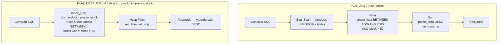
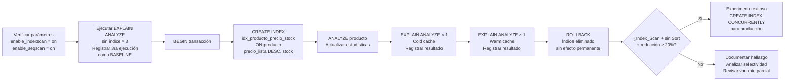

# Design Document

## Overview

### Problema de rendimiento identificado

La tabla `producto` contiene aproximadamente 50.000 registros. La consulta objetivo aplica dos predicados de filtrado (`precio_lista BETWEEN 1000 AND 2500` y `stock > 50`) y un ordenamiento descendente (`ORDER BY precio_lista DESC`):

```sql
SELECT id_producto, nombre, precio_lista, stock
FROM producto
WHERE precio_lista BETWEEN 1000 AND 2500
  AND stock > 50
ORDER BY precio_lista DESC;
```

En ausencia del índice propuesto, el planificador de PostgreSQL selecciona el siguiente plan de ejecución:

1. **Seq_Scan** sobre `producto` — lee las ~50.000 filas completas de la tabla en orden físico de heap.
2. **Filter** — aplica ambos predicados en memoria, descartando las filas que no los satisfacen.
3. **Sort** — reordena el resultado residual en memoria (o en disco si supera `work_mem`) para cumplir con `ORDER BY precio_lista DESC`.

Este plan es ineficiente porque el Seq_Scan no puede aprovechar ninguna estructura de acceso directo, y el nodo Sort implica un costo adicional de ordenamiento que podría evitarse si el motor obtuviera las filas ya ordenadas desde el índice.

El índice existente `idx_producto_categoria_activo ON producto (id_categoria, activo) WHERE activo = TRUE` no cubre las columnas `precio_lista` ni `stock`, por lo que el Optimizador lo descarta para esta consulta.

### Solución propuesta

Crear un índice B-Tree compuesto sobre `(precio_lista DESC, stock)`:

```sql
CREATE INDEX idx_producto_precio_stock
ON producto (precio_lista DESC, stock);
```

Este índice permite al Optimizador:

- Reemplazar el Seq_Scan por un **Index_Scan** o **Bitmap_Index_Scan**, accediendo directamente al subconjunto de filas dentro del rango `BETWEEN 1000 AND 2500`.
- Eliminar el nodo **Sort**, ya que el recorrido del índice entrega las filas en el orden `precio_lista DESC` que requiere la cláusula `ORDER BY`.
- Aplicar el predicado `stock > 50` como condición de índice (`Index Cond`) durante el recorrido, reduciendo los heap tuple fetches.

### Impacto esperado

| Aspecto | Antes del índice | Después del índice |
|---|---|---|
| Método de acceso | Seq_Scan (50k filas) | Index_Scan / Bitmap_Index_Scan |
| Nodo Sort | Presente | Eliminado |
| Filas procesadas | ~50.000 | Solo las del rango de precio y stock |
| Execution Time | Referencia baseline | Reducción esperada ≥ 20% (warm cache) |

---

## Architecture

### Flujo de ejecución: antes y después del índice



> **Nota**: El nodo Sort desaparece porque el índice está definido con `precio_lista DESC` como columna líder, entregando las filas en el orden exacto que requiere `ORDER BY precio_lista DESC`.

### Flujo del procedimiento experimental



---

## Components and Interfaces

### 1. Índice principal: `idx_producto_precio_stock`

```sql
CREATE INDEX idx_producto_precio_stock
ON producto (precio_lista DESC, stock);
```

**Justificación técnica de cada decisión de diseño:**

| Decisión | Justificación |
|---|---|
| `precio_lista` como columna líder | Es la columna del predicado de rango `BETWEEN` y también de `ORDER BY`. Colocarla primero permite al B-Tree recorrer directamente el subárbol correspondiente al rango de precios. |
| Dirección `DESC` | El índice ordena las entradas de mayor a menor precio. Esto hace que el recorrido del índice en orden forward entregue las filas ya en el orden que requiere `ORDER BY precio_lista DESC`, eliminando el nodo Sort. |
| `stock` como segunda columna | Al ser la segunda columna del índice compuesto, permite aplicar el predicado `stock > 50` como `Index Cond` durante el recorrido del árbol, en lugar de aplicarlo como un `Filter` post-fetch sobre el heap. Esto reduce la cantidad de heap tuple fetches cuando la selectividad de `stock > 50` es significativa. |
| Sin cláusula `WHERE` (índice completo) | Aplica a todas las filas de la tabla independientemente de `activo`. Adecuado cuando la consulta no incluye el predicado `AND activo = TRUE`. |

**Consulta que aprovecha este índice:**

```sql
SELECT id_producto, nombre, precio_lista, stock
FROM producto
WHERE precio_lista BETWEEN 1000 AND 2500
  AND stock > 50
ORDER BY precio_lista DESC;
```

---

### 2. Variante parcial: `idx_producto_precio_stock_activo`

```sql
CREATE INDEX idx_producto_precio_stock_activo
ON producto (precio_lista DESC, stock)
WHERE activo = TRUE;
```

**Cuándo usar la variante parcial:**

- Cuando la proporción de productos con `activo = FALSE` es significativa (por ejemplo, más del 20-30% del total de filas). En ese caso, el índice parcial es más pequeño, más liviano en memoria de índice, y más rápido de mantener en operaciones DML.
- Cuando la consulta de producción siempre incluye el filtro `AND activo = TRUE`.

**Requisito obligatorio para que el Optimizador elija este índice:**

La consulta **debe** incluir el predicado `AND activo = TRUE` de forma explícita; de lo contrario, el Optimizador descartará el índice parcial porque no puede garantizar que cubre todas las filas relevantes:

```sql
-- Consulta compatible con el índice parcial:
SELECT id_producto, nombre, precio_lista, stock
FROM producto
WHERE precio_lista BETWEEN 1000 AND 2500
  AND stock > 50
  AND activo = TRUE          -- predicado requerido
ORDER BY precio_lista DESC;
```

---

### 3. Script de evaluación experimental (`optimization_experiment.sql`)

El script implementa el protocolo completo del experimento en tres bloques diferenciados:

#### Bloque A — Pre-verificación de condiciones

```sql
-- Verificar que los parámetros del planificador estén en valores predeterminados
SHOW enable_indexscan;
SHOW enable_seqscan;
-- Ambos deben retornar 'on' para garantizar condiciones neutrales
```

#### Bloque B — Medición de baseline (sin índice)

```sql
-- Ejecutar 3 veces consecutivas; registrar la 3ra como baseline (warm cache)
EXPLAIN (ANALYZE, BUFFERS, FORMAT TEXT)
SELECT id_producto, nombre, precio_lista, stock
FROM producto
WHERE precio_lista BETWEEN 1000 AND 2500
  AND stock > 50
ORDER BY precio_lista DESC;
```

#### Bloque C — Experimento transaccional (con índice, con ROLLBACK)

```sql
BEGIN;

    CREATE INDEX idx_producto_precio_stock
    ON producto (precio_lista DESC, stock);

    -- Actualizar estadísticas para que el Optimizador tome decisiones correctas
    ANALYZE producto;

    -- 1ra ejecución post-índice (cold cache)
    EXPLAIN (ANALYZE, BUFFERS, FORMAT TEXT)
    SELECT id_producto, nombre, precio_lista, stock
    FROM producto
    WHERE precio_lista BETWEEN 1000 AND 2500
      AND stock > 50
    ORDER BY precio_lista DESC;

    -- 2da ejecución post-índice (warm cache) — esta es la medición de comparación
    EXPLAIN (ANALYZE, BUFFERS, FORMAT TEXT)
    SELECT id_producto, nombre, precio_lista, stock
    FROM producto
    WHERE precio_lista BETWEEN 1000 AND 2500
      AND stock > 50
    ORDER BY precio_lista DESC;

ROLLBACK;
-- El índice queda eliminado al hacer ROLLBACK; no hay efectos permanentes en la BD
```

#### Bloque D — Promoción a producción (solo si el experimento es exitoso)

```sql
-- Ejecutar FUERA de bloque transaccional; CONCURRENTLY evita bloqueos de escritura
CREATE INDEX CONCURRENTLY idx_producto_precio_stock
ON producto (precio_lista DESC, stock);
```

---

### 4. Comandos de verificación y mantenimiento de estadísticas

| Comando | Propósito | Momento de ejecución |
|---|---|---|
| `SHOW enable_indexscan;` | Confirmar que el planificador puede elegir Index Scan | Antes de cualquier medición |
| `SHOW enable_seqscan;` | Confirmar que el planificador puede elegir Seq Scan | Antes de cualquier medición |
| `ANALYZE producto;` | Actualizar histogramas y estadísticas de distribución de valores | Inmediatamente después de CREATE INDEX |
| `\d producto` (psql) | Listar los índices activos sobre la tabla | Verificación visual antes/después |

---

## Data Models

### Estructura interna del índice B-Tree `idx_producto_precio_stock`

El índice B-Tree almacena entradas en el formato `(precio_lista DESC, stock, tid)`, donde `tid` es el identificador físico de la fila en el heap:

```
Página Raíz
│
├── Páginas Internas (nodos intermedios)
│   ├── [precio_lista = 2500 ... 2000]
│   ├── [precio_lista = 2000 ... 1500]
│   └── [precio_lista = 1500 ... 1000]
│
└── Páginas Hoja (entradas ordenadas DESC)
    ├── (2500.00, 120, tid→fila_A)
    ├── (2499.50, 85,  tid→fila_B)
    ├── (2499.00, 52,  tid→fila_C)
    │   ...
    ├── (1000.50, 200, tid→fila_X)
    └── (1000.00, 51,  tid→fila_Y)
```

**Cobertura del predicado `BETWEEN` en el B-Tree:**

El Optimizador transforma `precio_lista BETWEEN 1000 AND 2500` en dos condiciones de límite sobre el árbol:
- Límite inferior: `precio_lista >= 1000` → PostgreSQL localiza el nodo hoja con la primera entrada `≥ 1000` (navegando desde la raíz).
- Límite superior: `precio_lista <= 2500` → PostgreSQL detiene el recorrido al encontrar la primera entrada `> 2500`.

El recorrido forward del árbol (de hojas más altas hacia más bajas en valor, dado que está definido `DESC`) entrega las filas directamente en el orden que requiere `ORDER BY precio_lista DESC`.

**Por qué `stock` como segunda columna permite `Index Cond` en lugar de `Filter`:**

Dentro del rango de `precio_lista` seleccionado, las entradas del índice contienen el valor de `stock` para cada fila. El Optimizador puede evaluar `stock > 50` directamente sobre las entradas del índice, sin necesidad de ir al heap a leer la fila completa para ese filtro. Esto se refleja en el plan como `Index Cond: (stock > 50)` en lugar de `Filter: (stock > 50)`, lo que reduce el número de heap fetches.

### Comparativa: índice completo vs. índice parcial

| Característica | `idx_producto_precio_stock` (completo) | `idx_producto_precio_stock_activo` (parcial) |
|---|---|---|
| Definición | `ON producto (precio_lista DESC, stock)` | `ON producto (precio_lista DESC, stock) WHERE activo = TRUE` |
| Filas indexadas | Todas (~50.000) | Solo activos (depende de la proporción) |
| Tamaño estimado del índice | Mayor | Menor (proporcional a filas activas) |
| Costo de mantenimiento (INSERT/UPDATE) | Mayor | Menor (solo se actualiza para filas activas) |
| Consultas compatibles | Sin restricción sobre `activo` | Requiere `AND activo = TRUE` en la consulta |
| Caso de uso recomendado | Consultas que no filtran por `activo`, o cuando casi todos los productos están activos | Consultas que siempre filtran `activo = TRUE` y hay proporción significativa de inactivos |
| Predicado obligatorio en la consulta | No requerido | `AND activo = TRUE` obligatorio |

---

## Error Handling

### Caso 1: El Optimizador elige Seq_Scan aunque el índice existe

**Causa**: La selectividad combinada de `precio_lista BETWEEN 1000 AND 2500 AND stock > 50` no descarta suficientes filas. Si el resultado retorna más de ~7.500 filas (más del 15% de 50.000), el Optimizador puede estimar que el Seq_Scan es más barato que múltiples accesos al heap mediante Index_Scan.

**Comportamiento esperado**: Este es un comportamiento correcto del planificador, no un defecto del índice. El B-Tree optimizer de PostgreSQL utiliza modelos de costo basados en estadísticas de distribución para tomar esta decisión.

**Acción**: Documentar el hallazgo en el informe del TP2. Verificar la selectividad real con:

```sql
SELECT COUNT(*) FROM producto
WHERE precio_lista BETWEEN 1000 AND 2500
  AND stock > 50;
-- Si el resultado es > ~7500 filas, el Seq_Scan puede ser legítimamente preferido
```

Si se desea forzar la evaluación del índice para fines de comparación académica, se puede usar temporalmente `SET enable_seqscan = off;` y volver a ejecutar `EXPLAIN`, aclarando en el informe que se trata de una medición forzada.

---

### Caso 2: `ANALYZE` no ejecutado después de crear el índice

**Causa**: Al crear el índice sobre una tabla con muchos registros, las estadísticas de distribución del catálogo (`pg_statistic`) pueden no reflejar la correlación entre `precio_lista`, `stock` y la distribución de tuplas en el heap.

**Efecto**: El Optimizador toma decisiones de plan basadas en estadísticas desactualizadas, lo que puede producir estimaciones de filas incorrectas (`rows=X` en el plan vs. filas reales) y llevar al planificador a seleccionar un plan subóptimo.

**Acción correctiva**: Siempre ejecutar `ANALYZE producto;` inmediatamente después de `CREATE INDEX` y antes de ejecutar cualquier `EXPLAIN ANALYZE` de comparación.

---

### Caso 3: Parámetros `enable_seqscan = off` o `enable_indexscan = off` activos en la sesión

**Causa**: Si alguna sesión anterior de `psql` modificó los parámetros del planificador y no los restauró, la comparación entre baseline y post-índice queda invalidada porque las condiciones de evaluación son asimétricas.

**Efecto**: El experimento no refleja el comportamiento real del Optimizador; los resultados no son reproducibles.

**Detección**: Ejecutar antes de cualquier medición:

```sql
SHOW enable_indexscan;   -- Debe retornar 'on'
SHOW enable_seqscan;     -- Debe retornar 'on'
```

**Acción correctiva**: Si alguno retorna `off`, restaurar con:

```sql
SET enable_seqscan = on;
SET enable_indexscan = on;
```

---

### Caso 4: ROLLBACK del bloque transaccional del experimento

**Comportamiento**: El `ROLLBACK` al final del bloque C del script elimina el índice `idx_producto_precio_stock` como si nunca hubiera sido creado. Esto es intencional y deseable para mantener la base de datos de desarrollo en estado limpio.

**Efecto en la base de datos**: Ninguno — todas las operaciones DDL dentro de la transacción quedan revertidas. Los planes medidos dentro del bloque sí corresponden al estado con el índice activo.

**Consideración**: `EXPLAIN ANALYZE` dentro de un bloque `BEGIN/ROLLBACK` ejecuta físicamente la consulta y refleja el plan real con el índice activo. Los resultados de tiempo son válidos como evidencia experimental.

---

### Caso 5: Uso incorrecto de `CREATE INDEX CONCURRENTLY` dentro de una transacción

**Causa**: `CREATE INDEX CONCURRENTLY` no puede ejecutarse dentro de un bloque transaccional explícito (`BEGIN`/`COMMIT`). Si se intenta, PostgreSQL emite un error.

**Acción**: `CREATE INDEX CONCURRENTLY` solo se ejecuta en el Bloque D (promoción a producción), que está explícitamente fuera de cualquier transacción.

---

## Testing Strategy

### Enfoque general

Este proyecto es puramente de base de datos SQL sin lógica de aplicación propia. Todos los criterios de aceptación verifican comportamientos del planificador de PostgreSQL (un sistema externo) o son requisitos procedimentales del protocolo de evaluación. Por este motivo, **no aplica property-based testing** — no existe una función propia con inputs/outputs sobre la cual formular propiedades universales.

La estrategia de prueba consiste en **tests de integración** (verificación del plan de ejecución generado por PostgreSQL) y **smoke tests** (verificación de condiciones de entorno y pasos procedimentales), ejecutados manualmente mediante `psql` o un gestor compatible como DBeaver, sobre la base de datos de desarrollo `foodstore_dev`.

---

### Protocolo de prueba paso a paso

#### Paso 1 — Verificar condiciones del planificador (pre-condición)

```sql
SHOW enable_indexscan;
SHOW enable_seqscan;
```

**Criterio de pase**: Ambos retornan `on`. Si alguno retorna `off`, ejecutar `SET enable_seqscan = on; SET enable_indexscan = on;` y reiniciar el experimento.

---

#### Paso 2 — Medición de baseline (sin índice, 3 ejecuciones)

Ejecutar el siguiente bloque **tres veces consecutivas** sin consultas intermedias sobre `producto`:

```sql
EXPLAIN (ANALYZE, BUFFERS, FORMAT TEXT)
SELECT id_producto, nombre, precio_lista, stock
FROM producto
WHERE precio_lista BETWEEN 1000 AND 2500
  AND stock > 50
ORDER BY precio_lista DESC;
```

**Registrar de la 3ra ejecución** (warm cache, cache de buffers compartidos caliente):
- Nodo de acceso a la tabla (debe ser `Seq Scan on producto`)
- Presencia del nodo `Sort`
- `Planning Time` (ms)
- `Execution Time` (ms) → este valor es el **baseline de referencia**
- Filas estimadas vs. filas reales
- `Buffers: shared hit` y bloques de heap leídos

---

#### Paso 3 — Experimento transaccional (con índice, con ROLLBACK)

```sql
BEGIN;

    -- Crear el índice propuesto
    CREATE INDEX idx_producto_precio_stock
    ON producto (precio_lista DESC, stock);

    -- Actualizar estadísticas (obligatorio)
    ANALYZE producto;

    -- Medición cold cache (1ra ejecución post-índice)
    EXPLAIN (ANALYZE, BUFFERS, FORMAT TEXT)
    SELECT id_producto, nombre, precio_lista, stock
    FROM producto
    WHERE precio_lista BETWEEN 1000 AND 2500
      AND stock > 50
    ORDER BY precio_lista DESC;

    -- Medición warm cache (2da ejecución post-índice) — medición de comparación
    EXPLAIN (ANALYZE, BUFFERS, FORMAT TEXT)
    SELECT id_producto, nombre, precio_lista, stock
    FROM producto
    WHERE precio_lista BETWEEN 1000 AND 2500
      AND stock > 50
    ORDER BY precio_lista DESC;

ROLLBACK;
```

**Registrar de cada ejecución**:
- Nodo de acceso (debe ser `Index Scan` o `Bitmap Index Scan` referenciando `idx_producto_precio_stock`)
- Ausencia del nodo `Sort`
- `Execution Time` (ms) — cold y warm cache por separado
- `Buffers: shared hit` del índice (debe ser > 0)
- Bloques de heap leídos (deben ser menores que en el baseline)

---

#### Paso 4 — Comparación y evaluación de criterios de éxito

**Tabla de métricas a registrar:**

| Métrica | Baseline (3ra ejec.) | Post-índice cold (1ra) | Post-índice warm (2da) |
|---|---|---|---|
| Nodo de acceso | Seq_Scan | ? | ? |
| Nodo Sort presente | Sí | ? | ? |
| Planning Time (ms) | X | ? | ? |
| Execution Time (ms) | X | ? | ? |
| Filas estimadas | X | ? | ? |
| Filas reales | X | ? | ? |
| Shared Hit — índice | 0 | ? | ? |
| Heap blocks leídos | N | ? | ? |

**Criterios de éxito (todos deben cumplirse):**

| Criterio | Verificación | Resultado esperado |
|---|---|---|
| R4.1 — Reemplazo de Seq_Scan | Plan post-índice no contiene `Seq Scan on producto` | `Index Scan` o `Bitmap Index Scan` |
| R4.2 — Eliminación del nodo Sort | Plan post-índice no contiene nodo `Sort` | Sort ausente |
| R4.3 — Reducción de Execution Time ≥ 20% | `(baseline_ms - warm_ms) / baseline_ms >= 0.20` | Sí |
| R4.5 — Shared Hit del índice > 0 | `Buffers: shared hit` incluye páginas del índice | > 0 |
| R4.5 — Heap blocks < baseline | Bloques de heap leídos post-índice < baseline | Menor |

**Fórmula de reducción porcentual:**

```
reducción (%) = ((Execution_Time_baseline - Execution_Time_warm) / Execution_Time_baseline) × 100
```

---

#### Paso 5 — Decisión y acción posterior

**Si todos los criterios se cumplen:**

El experimento es exitoso. Documentar ambas salidas completas de `EXPLAIN (ANALYZE, BUFFERS)` en el informe del TP2. Para promover el índice a producción:

```sql
-- FUERA de bloque transaccional — evita bloqueos de escritura durante la construcción
CREATE INDEX CONCURRENTLY idx_producto_precio_stock
ON producto (precio_lista DESC, stock);
```

**Si el Optimizador mantiene Seq_Scan tras crear el índice:**

Verificar la selectividad real:

```sql
SELECT COUNT(*) FROM producto
WHERE precio_lista BETWEEN 1000 AND 2500 AND stock > 50;
```

Si el resultado supera ~7.500 filas, documentar que el Optimizador toma la decisión correcta según sus modelos de costo (ver R4.4). No se trata de un error del índice. Evaluar si la variante parcial con `WHERE activo = TRUE` mejora la selectividad.

**Si se desea evaluar la variante parcial:**

```sql
BEGIN;
    CREATE INDEX idx_producto_precio_stock_activo
    ON producto (precio_lista DESC, stock)
    WHERE activo = TRUE;

    ANALYZE producto;

    EXPLAIN (ANALYZE, BUFFERS, FORMAT TEXT)
    SELECT id_producto, nombre, precio_lista, stock
    FROM producto
    WHERE precio_lista BETWEEN 1000 AND 2500
      AND stock > 50
      AND activo = TRUE          -- predicado obligatorio para usar el índice parcial
    ORDER BY precio_lista DESC;
ROLLBACK;
```
