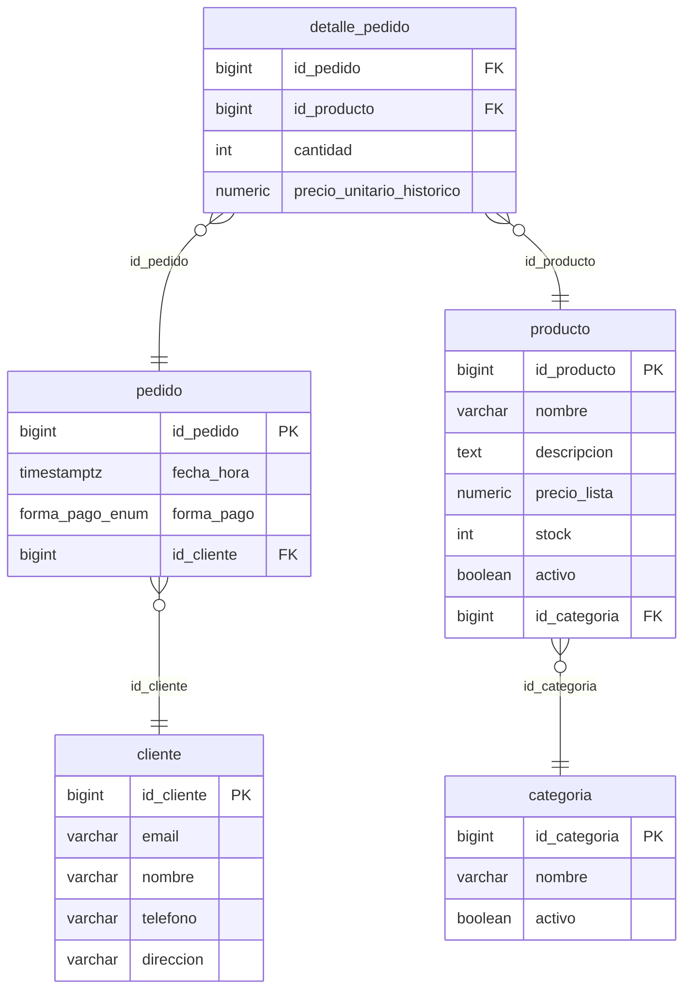
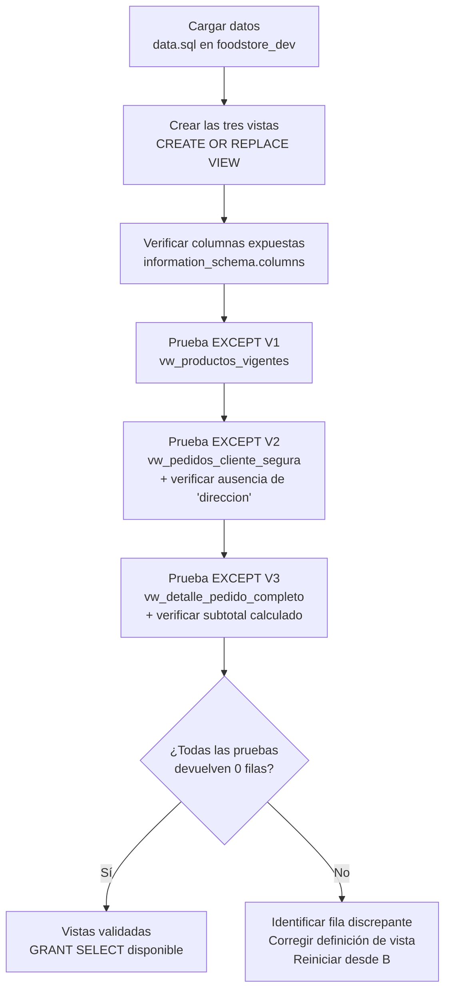

# Documento de Diseño Técnico: Vistas Transaccionales y de Reportes — FoodStore

## Overview

### Problema

Las consultas frecuentes del sistema FoodStore requieren unir múltiples tablas (`producto + categoria`, `pedido + cliente`, `detalle_pedido + producto`) con filtros y proyecciones que se repiten en distintos contextos. Además, la exposición directa de la tabla `cliente` a roles analíticos incluiría la columna `direccion` (dato personal), lo que viola el principio de mínimo privilegio.

### Solución

Tres vistas SQL que encapsulan la lógica de JOIN, filtrado y proyección de columnas:

| Vista | Tablas base | Propósito principal |
|-------|------------|---------------------|
| `vw_productos_vigentes` | `producto` + `categoria` | Listado de productos activos con categoría activa |
| `vw_pedidos_cliente_segura` | `pedido` + `cliente` | Pedidos con datos del cliente, sin `direccion` |
| `vw_detalle_pedido_completo` | `detalle_pedido` + `producto` | Detalle con nombre, cantidad, precio histórico y subtotal |

### Decisión de diseño: columna sensible en `cliente`

La tabla `cliente` del esquema FoodStore **no incluye columna de contraseña o password**. La columna de dato personal a omitir es `direccion` (VARCHAR 200). Esta decisión está documentada explícitamente en R2.3 y R2.7 del requirements.md. Si en el futuro se añade una columna sensible, la vista deberá revisarse (R2.7).

---

## Architecture

### Diagrama de relaciones entre vistas y tablas base



### Mapeo vistas → columnas expuestas

```
vw_productos_vigentes
├── p.id_producto
├── p.nombre          → nombre_producto
├── p.descripcion
├── p.precio_lista
├── p.stock
├── c.id_categoria
└── c.nombre          → nombre_categoria
    [OMITIDAS: p.activo, c.activo]

vw_pedidos_cliente_segura
├── p.id_pedido
├── p.fecha_hora
├── p.forma_pago
├── c.id_cliente
├── c.nombre          → nombre_cliente
├── c.email
└── c.telefono
    [OMITIDA: c.direccion  ← DATO PERSONAL]

vw_detalle_pedido_completo
├── dp.id_pedido
├── dp.id_producto
├── pr.nombre         → nombre_producto
├── dp.cantidad
├── dp.precio_unitario_historico
└── (dp.cantidad * dp.precio_unitario_historico) → subtotal  ← CALCULADA
```

### Flujo del protocolo de pruebas



---

## Components and Interfaces

### 1. Vista `vw_productos_vigentes`

```sql
CREATE OR REPLACE VIEW vw_productos_vigentes AS
SELECT
    p.id_producto,
    p.nombre          AS nombre_producto,
    p.descripcion,
    p.precio_lista,
    p.stock,
    c.id_categoria,
    c.nombre          AS nombre_categoria
FROM producto p
INNER JOIN categoria c ON p.id_categoria = c.id_categoria
WHERE p.activo = TRUE
  AND c.activo = TRUE;
```

**Decisiones de diseño:**

| Decisión | Justificación |
|----------|--------------|
| `INNER JOIN` (no LEFT) | Garantiza que todo producto expuesto tiene categoría registrada. Un producto sin categoría activa no debe aparecer en el menú. |
| `p.activo = TRUE AND c.activo = TRUE` | Filtro de vigencia doble: ambas entidades deben estar activas. Una categoría desactivada retira del menú todos sus productos. |
| Alias `nombre_producto` / `nombre_categoria` | Desambigua las dos columnas `nombre` (una de `producto`, otra de `categoria`) en el resultado de la vista. |
| Omisión de `p.activo` y `c.activo` | No tiene sentido exponer la columna de filtro: toda fila de la vista ya cumple `activo = TRUE`. Exponer la columna induciría a pensar que puede haber filas con `activo = FALSE`. |

**Consulta de uso típico:**
```sql
-- Listado del menú para la pantalla de pedidos:
SELECT nombre_producto, precio_lista, stock, nombre_categoria
FROM vw_productos_vigentes
WHERE stock > 0
ORDER BY nombre_categoria, nombre_producto;
```

---

### 2. Vista `vw_pedidos_cliente_segura`

```sql
CREATE OR REPLACE VIEW vw_pedidos_cliente_segura AS
SELECT
    p.id_pedido,
    p.fecha_hora,
    p.forma_pago,
    c.id_cliente,
    c.nombre          AS nombre_cliente,
    c.email,
    c.telefono
FROM pedido p
INNER JOIN cliente c ON p.id_cliente = c.id_cliente;
```

**Decisiones de diseño:**

| Decisión | Justificación |
|----------|--------------|
| Omisión explícita de `c.direccion` | `direccion` es un dato personal (domicilio físico). Omitirla de la vista permite otorgar `GRANT SELECT` a roles analíticos sin exponer PII sensible. |
| Sin filtro `WHERE` | La vista expone todos los pedidos (histórico completo). Los filtros temporales o por cliente se aplican en las consultas que consumen la vista. |
| `INNER JOIN` sobre `id_cliente` | Todo pedido del esquema tiene FK obligatoria a `cliente`; el INNER JOIN no pierde filas vs. LEFT JOIN en este caso. |
| `forma_pago` sin CAST | El tipo `forma_pago_enum` se expone directamente. Los consumidores filtran con `WHERE forma_pago = 'TARJETA'` usando el literal del ENUM. |
| Columnas explícitas (no `SELECT *`) | Si se añade una columna sensible a `cliente` en el futuro, la vista no la heredará automáticamente, requiriendo una revisión consciente. |

**Comando de permisos:**
```sql
-- Otorgar lectura a un rol analítico:
GRANT SELECT ON vw_pedidos_cliente_segura TO rol_reportes;
-- El rol NO tiene GRANT sobre la tabla cliente directamente.
```

**Consulta de uso típico:**
```sql
-- Historial de pedidos de un cliente con sus datos:
SELECT id_pedido, fecha_hora, forma_pago, nombre_cliente, email
FROM vw_pedidos_cliente_segura
WHERE id_cliente = 42
ORDER BY fecha_hora DESC;
```

---

### 3. Vista `vw_detalle_pedido_completo`

```sql
CREATE OR REPLACE VIEW vw_detalle_pedido_completo AS
SELECT
    dp.id_pedido,
    dp.id_producto,
    pr.nombre                                         AS nombre_producto,
    dp.cantidad,
    dp.precio_unitario_historico,
    (dp.cantidad * dp.precio_unitario_historico)      AS subtotal
FROM detalle_pedido dp
INNER JOIN producto pr ON dp.id_producto = pr.id_producto;
```

**Decisiones de diseño:**

| Decisión | Justificación |
|----------|--------------|
| `precio_unitario_historico` (no `pr.precio_lista`) | El precio del producto puede cambiar. La columna histórica en `detalle_pedido` preserva el precio al momento de la compra, garantizando que los subtotales de pedidos pasados no se alteren. |
| `subtotal` como columna calculada en la vista | Centraliza el cálculo `cantidad × precio_unitario_historico` para que todos los consumidores usen la misma fórmula, evitando divergencias. |
| `INNER JOIN` sobre `id_producto` | Todo `id_producto` en `detalle_pedido` tiene FK a `producto` con `ON DELETE RESTRICT`, por lo que el INNER JOIN no pierde filas. |
| Sin filtro `WHERE` | La vista es un cursor completo del detalle; los filtros por pedido específico se aplican desde fuera. |

**Consulta de uso típico:**
```sql
-- Total de un pedido específico:
SELECT id_pedido, SUM(subtotal) AS total_pedido
FROM vw_detalle_pedido_completo
WHERE id_pedido = 1
GROUP BY id_pedido;

-- Reporte completo de un pedido:
SELECT nombre_producto, cantidad, precio_unitario_historico, subtotal
FROM vw_detalle_pedido_completo
WHERE id_pedido = 1
ORDER BY nombre_producto;
```

---

### 4. Script `vistas_reportes.sql`

Archivo de implementación que consolida las tres vistas y el protocolo de pruebas:

**Bloque 1 — Creación de las tres vistas:**
```sql
-- Crear / reemplazar las tres vistas
CREATE OR REPLACE VIEW vw_productos_vigentes AS ...;
CREATE OR REPLACE VIEW vw_pedidos_cliente_segura AS ...;
CREATE OR REPLACE VIEW vw_detalle_pedido_completo AS ...;
```

**Bloque 2 — Verificación de columnas expuestas:**
```sql
SELECT table_name, column_name, data_type, ordinal_position
FROM information_schema.columns
WHERE table_name IN (
    'vw_productos_vigentes',
    'vw_pedidos_cliente_segura',
    'vw_detalle_pedido_completo'
)
ORDER BY table_name, ordinal_position;
-- Verificar: vw_pedidos_cliente_segura NO debe mostrar 'direccion'
```

**Bloque 3 — Pruebas de equivalencia EXCEPT (bidireccionales):**
```sql
-- V1: Consulta nativa EXCEPT vista (debe retornar 0 filas)
SELECT p.id_producto, p.nombre, p.descripcion, p.precio_lista, p.stock,
       p.id_categoria, c.nombre
FROM producto p INNER JOIN categoria c ON p.id_categoria = c.id_categoria
WHERE p.activo = TRUE AND c.activo = TRUE
EXCEPT
SELECT id_producto, nombre_producto, descripcion, precio_lista, stock,
       id_categoria, nombre_categoria
FROM vw_productos_vigentes;

-- V1 inversa: vista EXCEPT consulta nativa (debe retornar 0 filas)
SELECT id_producto, nombre_producto, descripcion, precio_lista, stock,
       id_categoria, nombre_categoria
FROM vw_productos_vigentes
EXCEPT
SELECT p.id_producto, p.nombre, p.descripcion, p.precio_lista, p.stock,
       p.id_categoria, c.nombre
FROM producto p INNER JOIN categoria c ON p.id_categoria = c.id_categoria
WHERE p.activo = TRUE AND c.activo = TRUE;

-- V2: Consulta nativa EXCEPT vista (debe retornar 0 filas)
SELECT p.id_pedido, p.fecha_hora, p.forma_pago,
       c.id_cliente, c.nombre, c.email, c.telefono
FROM pedido p INNER JOIN cliente c ON p.id_cliente = c.id_cliente
EXCEPT
SELECT id_pedido, fecha_hora, forma_pago,
       id_cliente, nombre_cliente, email, telefono
FROM vw_pedidos_cliente_segura;

-- V2 inversa
SELECT id_pedido, fecha_hora, forma_pago,
       id_cliente, nombre_cliente, email, telefono
FROM vw_pedidos_cliente_segura
EXCEPT
SELECT p.id_pedido, p.fecha_hora, p.forma_pago,
       c.id_cliente, c.nombre, c.email, c.telefono
FROM pedido p INNER JOIN cliente c ON p.id_cliente = c.id_cliente;

-- V3: Consulta nativa EXCEPT vista (debe retornar 0 filas)
SELECT dp.id_pedido, dp.id_producto, pr.nombre, dp.cantidad,
       dp.precio_unitario_historico,
       (dp.cantidad * dp.precio_unitario_historico)
FROM detalle_pedido dp INNER JOIN producto pr ON dp.id_producto = pr.id_producto
EXCEPT
SELECT id_pedido, id_producto, nombre_producto, cantidad,
       precio_unitario_historico, subtotal
FROM vw_detalle_pedido_completo;

-- V3 inversa
SELECT id_pedido, id_producto, nombre_producto, cantidad,
       precio_unitario_historico, subtotal
FROM vw_detalle_pedido_completo
EXCEPT
SELECT dp.id_pedido, dp.id_producto, pr.nombre, dp.cantidad,
       dp.precio_unitario_historico,
       (dp.cantidad * dp.precio_unitario_historico)
FROM detalle_pedido dp INNER JOIN producto pr ON dp.id_producto = pr.id_producto;
```

**Bloque 4 — Prueba de seguridad de columnas:**
```sql
-- Confirmar que 'direccion' NO está en vw_pedidos_cliente_segura:
SELECT column_name
FROM information_schema.columns
WHERE table_name = 'vw_pedidos_cliente_segura'
  AND column_name = 'direccion';
-- Debe devolver 0 filas.
```

---

## Data Models

### Proyección de columnas por vista

| Columna origen | Tabla origen | Vista(s) que la expone | Alias en vista | Tipo |
|----------------|-------------|------------------------|----------------|------|
| `id_producto` | `producto` | V1, V3 | `id_producto` | BIGINT |
| `nombre` | `producto` | V1, V3 | `nombre_producto` | VARCHAR(100) |
| `descripcion` | `producto` | V1 | `descripcion` | TEXT |
| `precio_lista` | `producto` | V1 | `precio_lista` | NUMERIC(10,2) |
| `stock` | `producto` | V1 | `stock` | INT |
| `id_categoria` | `producto` | V1 | `id_categoria` | BIGINT |
| `nombre` | `categoria` | V1 | `nombre_categoria` | VARCHAR(80) |
| `id_pedido` | `pedido` | V2, V3 | `id_pedido` | BIGINT |
| `fecha_hora` | `pedido` | V2 | `fecha_hora` | TIMESTAMPTZ |
| `forma_pago` | `pedido` | V2 | `forma_pago` | forma_pago_enum |
| `id_cliente` | `cliente` | V2 | `id_cliente` | BIGINT |
| `nombre` | `cliente` | V2 | `nombre_cliente` | VARCHAR(100) |
| `email` | `cliente` | V2 | `email` | VARCHAR(255) |
| `telefono` | `cliente` | V2 | `telefono` | VARCHAR(20) |
| `id_producto` | `detalle_pedido` | V3 | `id_producto` | BIGINT |
| `cantidad` | `detalle_pedido` | V3 | `cantidad` | INT |
| `precio_unitario_historico` | `detalle_pedido` | V3 | `precio_unitario_historico` | NUMERIC(10,2) |
| `calculada` | — | V3 | `subtotal` | NUMERIC |

**Columnas explícitamente omitidas:**

| Columna | Tabla | Vista que la omite | Razón |
|---------|-------|--------------------|-------|
| `activo` | `producto` | `vw_productos_vigentes` | Toda fila ya cumple `activo = TRUE`; redundante exponer el filtro |
| `activo` | `categoria` | `vw_productos_vigentes` | Ídem categoría |
| `direccion` | `cliente` | `vw_pedidos_cliente_segura` | Dato personal (domicilio); omisión de seguridad explícita |

---

## Error Handling

### Caso 1 — Vista consultada con tablas base vacías

**Condición:** Las tablas `producto`, `categoria`, `pedido`, `cliente` o `detalle_pedido` no tienen registros (base de datos recién inicializada sin ejecutar `data.sql`).

**Efecto:** Las tres vistas devuelven cero filas. Las pruebas `EXCEPT` también devuelven cero filas, lo que es técnicamente correcto pero no valida la lógica de la vista con datos reales.

**Acción:** Cargar `data.sql` antes de ejecutar las pruebas de equivalencia. Documentar que una prueba con cero filas en ambos lados no es concluyente.

---

### Caso 2 — Producto activo con categoría inactiva

**Condición:** `producto.activo = TRUE` pero `categoria.activo = FALSE` para la categoría de ese producto.

**Efecto:** `vw_productos_vigentes` **no incluye** dicho producto, por diseño (filtro doble `p.activo = TRUE AND c.activo = TRUE`).

**Acción:** Comportamiento esperado y correcto. Documentar en el informe que el filtro de vigencia institucional es dual.

---

### Caso 3 — Prueba EXCEPT devuelve filas

**Condición:** Alguna de las seis pruebas bidireccionales devuelve al menos una fila.

**Efecto:** La definición de la vista no es equivalente a la consulta nativa. Las causas más frecuentes son: alias incorrecto, predicado WHERE diferente, columna extra u omitida, o tipo de JOIN distinto.

**Acción:**
1. Ejecutar el SELECT de la vista y el SELECT nativo por separado para comparar filas.
2. Identificar la columna o fila que difiere.
3. Corregir la definición de la vista con `CREATE OR REPLACE VIEW`.
4. Volver a ejecutar la prueba EXCEPT.

---

### Caso 4 — `direccion` aparece en `vw_pedidos_cliente_segura`

**Condición:** Un `ALTER TABLE cliente ADD COLUMN direccion_nueva ...` con el mismo nombre que una columna ya omitida, o una recreación manual incorrecta de la vista con `SELECT *`.

**Efecto:** La vista expone un dato personal que debería estar oculto. Cualquier `GRANT SELECT` otorgado previamente permite el acceso a ese dato.

**Acción:**
1. Ejecutar la prueba de seguridad del Bloque 4 del script.
2. Si `direccion` aparece: `CREATE OR REPLACE VIEW vw_pedidos_cliente_segura AS ...` con columnas explícitas.
3. Auditar si se otorgó `GRANT` durante el período de exposición.

---

### Caso 5 — `subtotal` difiere de la suma directa desde las tablas base

**Condición:** Error aritmético o de precedencia en la expresión `(dp.cantidad * dp.precio_unitario_historico)`.

**Efecto:** La prueba EXCEPT bidireccional de V3 devuelve filas.

**Acción:** Verificar que la expresión en la vista usa paréntesis explícitos y que el tipo resultante de `INT * NUMERIC(10,2)` es `NUMERIC`, consistente con la columna comparada en el SELECT nativo.

---

## Testing Strategy

### Protocolo completo de validación (7 pasos)

**Paso 1 — Cargar datos de prueba:**
```sql
-- Asegurarse de que data.sql fue ejecutado y hay registros en todas las tablas:
SELECT COUNT(*) FROM producto;
SELECT COUNT(*) FROM categoria;
SELECT COUNT(*) FROM pedido;
SELECT COUNT(*) FROM cliente;
SELECT COUNT(*) FROM detalle_pedido;
-- Todas deben retornar > 0 para que las pruebas sean concluyentes.
```

**Paso 2 — Crear las tres vistas:**
```sql
CREATE OR REPLACE VIEW vw_productos_vigentes AS
SELECT p.id_producto, p.nombre AS nombre_producto, p.descripcion,
       p.precio_lista, p.stock, c.id_categoria, c.nombre AS nombre_categoria
FROM producto p INNER JOIN categoria c ON p.id_categoria = c.id_categoria
WHERE p.activo = TRUE AND c.activo = TRUE;

CREATE OR REPLACE VIEW vw_pedidos_cliente_segura AS
SELECT p.id_pedido, p.fecha_hora, p.forma_pago,
       c.id_cliente, c.nombre AS nombre_cliente, c.email, c.telefono
FROM pedido p INNER JOIN cliente c ON p.id_cliente = c.id_cliente;

CREATE OR REPLACE VIEW vw_detalle_pedido_completo AS
SELECT dp.id_pedido, dp.id_producto, pr.nombre AS nombre_producto,
       dp.cantidad, dp.precio_unitario_historico,
       (dp.cantidad * dp.precio_unitario_historico) AS subtotal
FROM detalle_pedido dp INNER JOIN producto pr ON dp.id_producto = pr.id_producto;
```

**Paso 3 — Verificar columnas expuestas:**
```sql
SELECT table_name, column_name, data_type, ordinal_position
FROM information_schema.columns
WHERE table_name IN (
    'vw_productos_vigentes', 'vw_pedidos_cliente_segura', 'vw_detalle_pedido_completo'
)
ORDER BY table_name, ordinal_position;
```

**Paso 4 — Prueba de seguridad: `direccion` ausente en V2:**
```sql
SELECT column_name
FROM information_schema.columns
WHERE table_name = 'vw_pedidos_cliente_segura' AND column_name = 'direccion';
-- Resultado esperado: 0 filas.
```

**Paso 5 — Pruebas EXCEPT bidireccionales (6 consultas, todas deben retornar 0 filas):**

Ver Bloque 3 del script `vistas_reportes.sql` en la sección Components and Interfaces.

**Paso 6 — Prueba funcional de subtotal:**
```sql
-- Verificar que la suma de subtotales por pedido coincide con cálculo directo:
SELECT
    v.id_pedido,
    SUM(v.subtotal)                                           AS total_por_vista,
    SUM(dp.cantidad * dp.precio_unitario_historico)           AS total_directo
FROM vw_detalle_pedido_completo v
JOIN detalle_pedido dp USING (id_pedido, id_producto)
GROUP BY v.id_pedido
HAVING SUM(v.subtotal) <> SUM(dp.cantidad * dp.precio_unitario_historico);
-- Resultado esperado: 0 filas (ningún pedido con discrepancia).
```

**Paso 7 — Prueba de filtro de vigencia doble (V1):**
```sql
-- Desactivar una categoría temporalmente y verificar que sus productos desaparecen de la vista:
BEGIN;
    UPDATE categoria SET activo = FALSE WHERE id_categoria = 1;
    -- Los productos de id_categoria = 1 NO deben aparecer en la vista:
    SELECT COUNT(*) FROM vw_productos_vigentes WHERE id_categoria = 1;
    -- Resultado esperado: 0 filas.
ROLLBACK;
-- La categoría queda restaurada a activo = TRUE tras el ROLLBACK.
```

### Tabla de resultados esperados

| Prueba | Consulta | Resultado esperado |
|--------|----------|--------------------|
| V1 equivalencia (nativa EXCEPT vista) | Ver Bloque 3 | 0 filas |
| V1 equivalencia (vista EXCEPT nativa) | Ver Bloque 3 | 0 filas |
| V2 equivalencia (nativa EXCEPT vista) | Ver Bloque 3 | 0 filas |
| V2 equivalencia (vista EXCEPT nativa) | Ver Bloque 3 | 0 filas |
| V3 equivalencia (nativa EXCEPT vista) | Ver Bloque 3 | 0 filas |
| V3 equivalencia (vista EXCEPT nativa) | Ver Bloque 3 | 0 filas |
| Seguridad: `direccion` ausente en V2 | Paso 4 | 0 filas |
| Vigencia doble: productos de categ. inactiva | Paso 7 | 0 filas |
| Subtotales sin discrepancia | Paso 6 | 0 filas |
