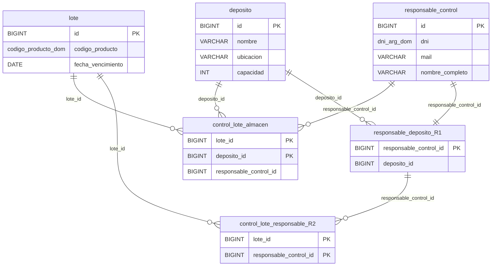
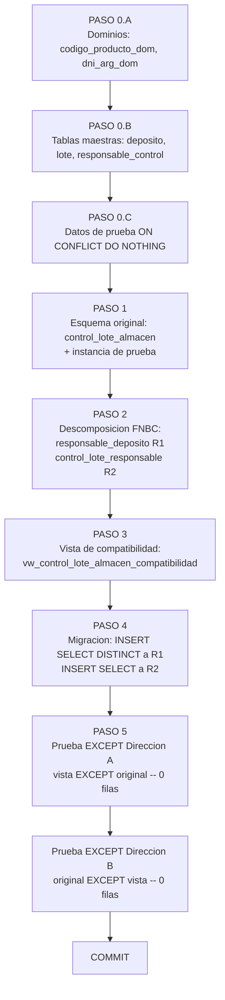
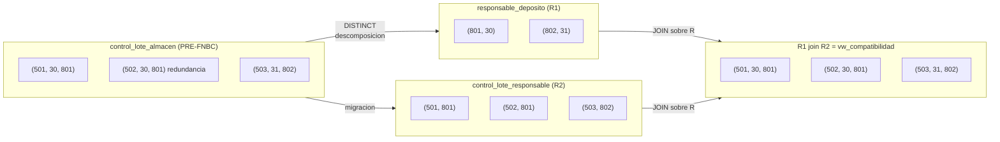

# Spec: Normalizacion FNBC — control_lote_almacen

**Archivo:** `tp_fnbc_control_lote.sql`  
**Motor:** PostgreSQL 17  
**Base:** foodstore_dev  
**Autora:** Agustina Micaela Guzman

---

# Requirements Document

## Introduction

Esta especificacion define los requisitos tecnicos para detectar, demostrar y corregir una violacion a la Forma Normal de Boyce-Codd (FNBC) en el modulo de trazabilidad mayorista de FoodStore. La tabla `control_lote_almacen` almacena el control de calidad de lotes de productos en depositos, con una clave primaria compuesta `(lote_id, deposito_id)`. El analisis de dependencias funcionales revela que el atributo `responsable_control_id` determina unicamente a `deposito_id` con independencia del lote auditado, lo que constituye una dependencia funcional cuyo determinante no es superclave y viola FNBC directamente.

El objetivo es modelar formalmente las dependencias funcionales, demostrar la violacion, descomponer el esquema en dos relaciones canonicas en FNBC aplicando el Teorema de Heath, migrar la instancia de prueba, crear una vista de compatibilidad que reconstituya la proyeccion original, y verificar la propiedad lossless-join mediante prueba de equivalencia de conjuntos con `EXCEPT` en ambas direcciones. Todo el proceso se consolida en un unico script DDL autocontenido, idempotente y encapsulado en `BEGIN ... COMMIT`, ejecutable directamente sobre `foodstore_dev`.

---

## Glossary

- **FNBC (Forma Normal de Boyce-Codd):** Una relacion esta en FNBC si, para toda dependencia funcional no trivial X -> Y, X es superclave de la relacion. Es mas restrictiva que la 3FN porque exige la condicion sobre toda DF, incluyendo las que involucran claves candidatas alternativas.
- **Dependencia funcional (DF):** Restriccion semantica X -> Y que establece que el valor de X determina univocamente el valor de Y en toda instancia valida de la relacion.
- **Superclave:** Conjunto de atributos que determina univocamente a todos los demas atributos de la relacion. La clave primaria es la superclave minimal (clave candidata).
- **Cerradura de atributos (X+):** Conjunto de todos los atributos determinados por X bajo un conjunto F de DFs. Si X+ contiene todos los atributos de la relacion, entonces X es superclave.
- **Descomposicion lossless-join:** Particion de una relacion R en R1 y R2 tal que R = R1 join R2 (la reunion natural reconstruye exactamente la instancia original, sin tuplas espurias ni perdida de tuplas).
- **Teorema de Heath:** Si R(A, B, C) satisface la DF A -> B, entonces R se puede descomponer sin perdida en R1(A, B) y R2(A, C), con atributo de reunion A (el determinante de la DF).
- **Tupla espuria:** Fila generada por la reunion natural que no existia en la relacion original; sintoma de una descomposicion con perdida.
- **Anomalia de actualizacion:** Inconsistencia que surge cuando un hecho del mundo real esta representado en multiples filas y una actualizacion parcial deja la base en estado contradictorio.
- **Vista de compatibilidad:** Vista SQL que reconstituye la proyeccion original a partir de las tablas descompuestas, permitiendo que el codigo existente continue operando sin cambios durante la transicion al nuevo esquema.
- **Prueba EXCEPT:** Tecnica de verificacion SQL que compara dos conjuntos de tuplas en ambas direcciones usando el operador `EXCEPT`. Si ambas direcciones devuelven 0 filas, los conjuntos son identicos.
- **Idempotencia:** Propiedad de un script que puede ejecutarse multiples veces sobre la misma base sin producir errores ni efectos duplicados.
- **Dominio PostgreSQL (CREATE DOMAIN):** Tipo de dato personalizado con restricciones de validacion centralizadas, reutilizable en cualquier tabla del esquema sin repetir la logica de CHECK en cada columna.

---

## Requirements

### Requisito 1: Modelado formal de dependencias funcionales

**User Story:** Como estudiante de Bases de Datos II, quiero modelar formalmente las dependencias funcionales de `control_lote_almacen`, para poder identificar con precision cual de ellas viola FNBC y justificar la necesidad de descomposicion.

#### Criterios de Aceptacion

1. THE Sistema SHALL identificar los tres atributos de la relacion original con las siguientes abreviaturas:
   - **L** = `lote_id` (BIGINT, referencia a `lote`)
   - **D** = `deposito_id` (BIGINT, referencia a `deposito`)
   - **R** = `responsable_control_id` (BIGINT, referencia a `responsable_control`)

2. THE Sistema SHALL identificar las dos dependencias funcionales sobre `control_lote_almacen(L, D, R)`:
   - **DF1:** {L, D} -> R — la PK compuesta determina univocamente al responsable asignado. DF valida: {L, D} es superclave.
   - **DF2:** R -> D — un responsable siempre opera en el mismo deposito, independientemente del lote. DF problematica: R no es superclave.

3. IF la instancia de prueba contiene las tuplas `(501, 30, 801)`, `(502, 30, 801)` y `(503, 31, 802)`, THEN THE Sistema SHALL evidenciar DF2 observando que el responsable 801 aparece asociado al deposito 30 en dos filas distintas, lo que representa redundancia estructural derivada de la DF R -> D.

4. WHEN se evalua DF2 contra la definicion de FNBC, THE Sistema SHALL calcular la cerradura de R bajo F: R+ = {R, D}. Dado que R+ no contiene L, R no es superclave de `control_lote_almacen`. Por tanto, DF2 viola FNBC.

---

### Requisito 2: Justificacion de decisiones de tipado DDL

**User Story:** Como estudiante de Bases de Datos II, quiero que cada decision de tipo de dato en el DDL este justificada semanicamente, para demostrar que el esquema no solo es tecnicamente correcto sino tambien coherente con el dominio del negocio.

#### Criterios de Aceptacion

1. THE Sistema SHALL usar `DATE` (no `TIMESTAMPTZ`) para `lote.fecha_vencimiento`. La caducidad legal de un alimento se expresa como dia calendario, no como instante con hora y zona horaria. Las comparaciones de negocio como `fecha_vencimiento < CURRENT_DATE` operan sobre fechas puras; usar `TIMESTAMPTZ` introduciria ambiguedad sobre el momento exacto del vencimiento (medianoche de que zona horaria).

2. THE Sistema SHALL usar `TIMESTAMPTZ` para cualquier columna que registre el instante en que ocurrio un evento del sistema, como `pedido.fecha_hora` en el esquema principal. La distincion es semantica: un vencimiento es un dia; una transaccion es un instante.

3. THE Sistema SHALL usar `VARCHAR(n)` con longitudes acotadas para todos los atributos de texto, documentando la razon del limite en cada caso:
   - `deposito.nombre VARCHAR(100)`: nombre descriptivo del almacen, longitud suficiente para denominaciones comerciales.
   - `deposito.ubicacion VARCHAR(255)`: direccion o localidad; longitud generosa para descripciones geograficas compuestas.
   - `lote.codigo_producto codigo_producto_dom` (VARCHAR(50) con dominio): codigos alfanumericos estructurados tipo `PROD-01`; el dominio centraliza la validacion de formato.
   - `responsable_control.dni dni_arg_dom` (VARCHAR(20) con dominio): DNI argentino; el dominio restringe a 7-8 digitos numericos.
   - `responsable_control.mail VARCHAR(100)`: direccion de correo con CHECK de formato minimo.
   - `responsable_control.nombre_completo VARCHAR(150)`: mayor longitud que `nombre` simple porque incluye nombre y apellido.

4. THE Sistema SHALL usar `BIGINT` para todos los identificadores surrogates y claves foraneas, justificado por el volumen potencial de registros en un sistema mayorista de escala.

5. THE Sistema SHALL usar `INT` (no `BIGINT`) para `deposito.capacidad`, porque la capacidad de un almacen es una cantidad entera de unidades fisicas (pallets, m3) que no requiere el rango de BIGINT; `CHECK (capacidad > 0)` descarta valores nulos o negativos que carecen de sentido fisico.

---

### Requisito 3: Descomposicion en FNBC por Teorema de Heath

**User Story:** Como estudiante de Bases de Datos II, quiero descomponer `control_lote_almacen` en dos relaciones en FNBC, para eliminar la anomalia de actualizacion y garantizar que la reunion natural reconstruye la instancia original sin perdida.

#### Criterios de Aceptacion

1. THE Sistema SHALL aplicar el Teorema de Heath sobre DF2: R -> D para descomponer `control_lote_almacen(L, D, R)` en:
   - **R1:** `responsable_deposito(R, D)` — aisla la DF R -> D; PK = R.
   - **R2:** `control_lote_responsable(L, R)` — conserva el vinculo lote-responsable; PK compuesta = {L, R}.

2. THE Sistema SHALL verificar que R1 esta en FNBC: la unica DF no trivial es R -> D, y R es la PK (superclave minimal). FNBC satisfecha.

3. THE Sistema SHALL verificar que R2 esta en FNBC: no hay atributos no-clave adicionales. La PK {L, R} es superclave de todos los atributos. FNBC satisfecha.

4. WHEN se ejecuta la reunion natural R1 join R2 sobre el atributo compartido R, THE Sistema SHALL reconstruir exactamente las tuplas `(501, 30, 801)`, `(502, 30, 801)` y `(503, 31, 802)`, sin tuplas espurias ni omisiones.

5. IF la FK de R2 referencia a `responsable_deposito(responsable_control_id)` en lugar de a `responsable_control(id)` directamente, THEN THE Motor SHALL garantizar que toda insercion en R2 requiere la existencia previa del par (R, D) en R1, preservando la integridad referencial que hace posible la reunion sin perdida.

---

### Requisito 4: Vista de compatibilidad hacia atras

**User Story:** Como estudiante de Bases de Datos II, quiero una vista que reconstituya la estructura original de `control_lote_almacen`, para que el codigo existente pueda seguir consultando esa proyeccion sin cambios durante la transicion.

#### Criterios de Aceptacion

1. THE Sistema SHALL crear la vista `vw_control_lote_almacen_compatibilidad` que proyecte `(lote_id, deposito_id, responsable_control_id)` mediante JOIN entre R2 y R1 sobre `responsable_control_id`.

2. WHEN se consulta `vw_control_lote_almacen_compatibilidad`, THE Vista SHALL devolver exactamente las mismas filas que `control_lote_almacen`, verificable mediante la prueba EXCEPT bidireccional del Requisito 5.

3. IF se agrega una nueva fila en R1 y su correspondiente fila en R2, THEN THE Vista SHALL incluir automaticamente la fila reconstruida sin necesidad de redefinirla.

---

### Requisito 5: Verificacion de reunion sin perdida mediante prueba EXCEPT

**User Story:** Como estudiante de Bases de Datos II, quiero verificar mediante una prueba SQL formal que la descomposicion es lossless-join, para demostrar que ninguna informacion fue perdida ni inventada durante el proceso.

#### Criterios de Aceptacion

1. THE Sistema SHALL ejecutar la prueba en direccion A: `vw_control_lote_almacen_compatibilidad EXCEPT control_lote_almacen`. Resultado esperado: 0 filas (sin tuplas espurias).

2. THE Sistema SHALL ejecutar la prueba en direccion B: `control_lote_almacen EXCEPT vw_control_lote_almacen_compatibilidad`. Resultado esperado: 0 filas (sin perdida de tuplas).

3. IF cualquiera de las dos direcciones devuelve al menos una fila, THEN THE Sistema SHALL considerar la descomposicion como incorrecta y requerir revision del JOIN en la vista o de la migracion de datos.

4. WHEN ambas pruebas devuelven 0 filas, THE Sistema SHALL considerar la descomposicion como valida y la propiedad lossless-join como demostrada experimentalmente sobre la instancia de prueba.

---

### Requisito 6: Script DDL autonomo e idempotente

**User Story:** Como estudiante de Bases de Datos II, quiero que todo el proceso este consolidado en un unico script DDL ejecutable, para poder reproducir el experimento completo en `foodstore_dev` sin dependencias externas.

#### Criterios de Aceptacion

1. THE Script SHALL estar encapsulado en un unico bloque `BEGIN; ... COMMIT;`, conforme al protocolo de seguridad del proyecto.

2. THE Script SHALL ser idempotente: ejecutarlo multiples veces no produce errores. Para ello, SHALL usar `CREATE TABLE IF NOT EXISTS` para DDL de tablas y `ON CONFLICT ... DO NOTHING` para DML de insercion.

3. THE Script SHALL ser autonomo: no requiere la ejecucion previa de ningun archivo externo (ni `schema.sql`, ni `data.sql`) para funcionar en una base vacia o en `foodstore_dev`.

4. WHEN el script se ejecuta con `psql -U postgres -d foodstore_dev -f tp_fnbc_control_lote.sql`, THE Motor SHALL completar todas las sentencias sin errores y confirmar la transaccion con `COMMIT`.

5. THE Script SHALL contener unicamente caracteres ASCII en los comentarios del encabezado, para garantizar compatibilidad con codificaciones WIN1252 y UTF-8 en cualquier cliente psql.

6. THE Script SHALL incluir encabezados de seccion claramente delimitados (`-- PASO 0`, `-- PASO 1`, etc.) y comentarios tecnicos por cada sentencia DDL/DML que expliquen la regla de negocio o la DF que justifica esa decision de diseno.

---

# Design Document

## Overview

### Problema identificado

La relacion `control_lote_almacen(lote_id, deposito_id, responsable_control_id)` con PK `{lote_id, deposito_id}` concentra dos hechos semanticamente independientes:

1. Que responsable audita que lote en que deposito (hecho correcto de la relacion).
2. A que deposito pertenece cada responsable (hecho independiente del lote).

El segundo hecho genera la DF problematica **R -> D**, cuyo determinante R no es superclave. Esto viola FNBC y produce:

- **Redundancia estructural:** el par `(responsable=801, deposito=30)` se repite en cada fila donde aparece ese responsable.
- **Anomalia de actualizacion:** cambiar el deposito de un responsable exige modificar multiples filas; una actualizacion parcial deja la base en estado inconsistente.
- **Anomalia de eliminacion:** eliminar el ultimo lote auditado por un responsable destruye tambien el hecho "ese responsable pertenece a ese deposito".

### Solucion propuesta

Aplicar el Teorema de Heath sobre DF2 para descomponer la relacion en dos esquemas en FNBC:

| Relacion | Atributos | PK | DF aislada |
|---|---|---|---|
| **R1** `responsable_deposito` | (R, D) | R | R -> D |
| **R2** `control_lote_responsable` | (L, R) | {L, R} | -- |

La reunion natural R1 join R2 reconstruye exactamente la instancia original (lossless-join). La vista `vw_control_lote_almacen_compatibilidad` materializa esa reunion para compatibilidad hacia atras.

---

## Architecture

### Diagrama 1 -- Estado ANTES y DESPUES de la descomposicion



### Diagrama 2 -- Flujo de ejecucion del script DDL



### Diagrama 3 -- Instancia de ejemplo y migracion lossless-join



---

## Components and Interfaces

### 1. Dominios reutilizables (Paso 0.A)

#### `codigo_producto_dom`

```sql
CREATE DOMAIN codigo_producto_dom AS VARCHAR(50)
    CONSTRAINT ck_codigo_producto_formato
        CHECK (VALUE ~ '^[A-Z0-9][A-Z0-9\-]{1,48}[A-Z0-9]$');
```

Acepta codigos alfanumericos en mayusculas con guiones internos. Ejemplos validos: `PROD-01`, `ABC-123`. Rechaza minusculas, guiones al inicio o fin, y cadenas vacías. Al ser un dominio, cualquier tabla futura hereda la validacion sin repetir el CHECK.

#### `dni_arg_dom`

```sql
CREATE DOMAIN dni_arg_dom AS VARCHAR(20)
    CONSTRAINT ck_dni_arg_formato
        CHECK (VALUE ~ '^\d{7,8}$');
```

Restringe el DNI argentino a exactamente 7 u 8 digitos numericos. Rechaza letras, puntos y espacios.

---

### 2. Tablas maestras (Paso 0.B)

#### `deposito`

```sql
CREATE TABLE IF NOT EXISTS deposito (
    id        BIGINT        PRIMARY KEY,
    nombre    VARCHAR(100)  NOT NULL,
    ubicacion VARCHAR(255)  NOT NULL,
    capacidad INT           NOT NULL
        CONSTRAINT chk_deposito_capacidad CHECK (capacidad > 0)
);
```

#### `lote`

```sql
CREATE TABLE IF NOT EXISTS lote (
    id                 BIGINT                PRIMARY KEY,
    codigo_producto    codigo_producto_dom   NOT NULL,
    fecha_vencimiento  DATE                  NOT NULL
        CONSTRAINT chk_lote_vencimiento CHECK (fecha_vencimiento >= CURRENT_DATE)
);
```

`fecha_vencimiento` es `DATE` (no `TIMESTAMPTZ`) porque la caducidad legal de un alimento se expresa como dia calendario. El CHECK impide registrar lotes ya vencidos al momento de la insercion.

#### `responsable_control`

```sql
CREATE TABLE IF NOT EXISTS responsable_control (
    id              BIGINT        PRIMARY KEY,
    dni             dni_arg_dom   NOT NULL UNIQUE,
    mail            VARCHAR(100)  NOT NULL
        CONSTRAINT chk_responsable_mail
            CHECK (mail ~ '^[^@\s]+@[^@\s]+\.[^@\s]+$'),
    nombre_completo VARCHAR(150)  NOT NULL
);
```

---

### 3. Esquema original defectuoso (Paso 1)

#### `control_lote_almacen`

```sql
CREATE TABLE IF NOT EXISTS control_lote_almacen (
    lote_id                 BIGINT  NOT NULL REFERENCES lote(id),
    deposito_id             BIGINT  NOT NULL REFERENCES deposito(id),
    responsable_control_id  BIGINT  NOT NULL REFERENCES responsable_control(id),
    PRIMARY KEY (lote_id, deposito_id)
);
```

Se conserva en el script como sujeto del analisis y oraculo para la prueba lossless-join.

---

### 4. Tablas descompuestas en FNBC (Paso 2)

#### R1: `responsable_deposito`

```sql
CREATE TABLE IF NOT EXISTS responsable_deposito (
    responsable_control_id  BIGINT  PRIMARY KEY
        REFERENCES responsable_control(id),
    deposito_id             BIGINT  NOT NULL
        REFERENCES deposito(id)
);
```

Aisla la DF problematica R -> D. La PK es el determinante de DF2, garantizando que cada responsable tenga exactamente un deposito asignado.

#### R2: `control_lote_responsable`

```sql
CREATE TABLE IF NOT EXISTS control_lote_responsable (
    lote_id                 BIGINT  NOT NULL REFERENCES lote(id),
    responsable_control_id  BIGINT  NOT NULL
        REFERENCES responsable_deposito(responsable_control_id),
    PRIMARY KEY (lote_id, responsable_control_id)
);
```

La FK apunta a `responsable_deposito` (no a `responsable_control` directamente). Esto es critico: garantiza que solo se vinculen responsables cuya asignacion de deposito ya existe en R1, haciendo posible la reunion sin perdida.

---

### 5. Vista de compatibilidad (Paso 3)

```sql
CREATE OR REPLACE VIEW vw_control_lote_almacen_compatibilidad AS
SELECT
    clr.lote_id,
    rd.deposito_id,
    clr.responsable_control_id
FROM control_lote_responsable  clr
JOIN responsable_deposito       rd
    ON clr.responsable_control_id = rd.responsable_control_id;
```

Reconstituye `(lote_id, deposito_id, responsable_control_id)` mediante la operacion inversa de la descomposicion: R1 join R2. Doble proposito: compatibilidad hacia atras y oraculo para la prueba EXCEPT del Paso 5.

---

## Data Models

### Analisis formal de dependencias funcionales

| Etiqueta | DF | Determinante es superclave | Satisface FNBC |
|---|---|---|---|
| DF1 | {L, D} -> R | Si ({L,D} es PK) | Si |
| DF2 | R -> D | No (R+ = {R,D}, no contiene L) | **No** |

### Prueba de violacion de FNBC para DF2

```
Condicion FNBC: para toda DF X -> Y no trivial, X debe ser superclave.

DF2: R -> D
  X  = {responsable_control_id}
  Y  = {deposito_id}
  X+ = {R, D}        (cerradura de R bajo F)
  X+ != {L, D, R}    -> X NO es superclave
  -> DF2 viola FNBC
```

### Justificacion teorica de la reunion sin perdida (Punto 4.2.f)

La descomposicion por Teorema de Heath garantiza la propiedad lossless-join
mediante el siguiente argumento sobre el atributo comun de la reunion:

**Paso 1 — Identificar el atributo comun entre R1 y R2**

```
R1 = responsable_deposito(responsable_control_id, deposito_id)
R2 = control_lote_responsable(lote_id, responsable_control_id)

Atributos(R1) ∩ Atributos(R2) = {responsable_control_id}
```

El unico atributo compartido entre las dos tablas descompuestas es
`responsable_control_id` (abreviado R). Es el atributo sobre el que
se realiza el JOIN en la vista de compatibilidad.

**Paso 2 — Verificar que el atributo comun es superclave en R1**

```
En R1 = responsable_deposito(R, D):
  PK(R1) = {responsable_control_id} = {R}

  Cerradura de R en R1: R+ = {R, D} = todos los atributos de R1
  Por tanto, R es superclave (de hecho, clave candidata) de R1.
```

**Paso 3 — Aplicar el criterio de superclave del Teorema de Heath**

El Teorema de Heath establece que la descomposicion de R(A, B, C) en
R1(A, B) y R2(A, C) es lossless-join si y solo si A -> B o A -> C
pertenece al conjunto de DFs de R.

En este caso:
```
R(L, D, R)  descompuesto en  R1(R, D)  y  R2(L, R)
Atributo comun: R
DF valida sobre R: R -> D  (DF2, el propio motivo de la descomposicion)
```

Como R -> D pertenece al conjunto de DFs y R es la clave primaria de R1
(superclave sobre el atributo comun), queda garantizado matematicamente que:

```
R1 ⋈ R2 = R  (reunion natural produce exactamente la instancia original)
```

No se generan tuplas espurias porque cada valor de R en R2 tiene exactamente
un valor de D en R1 (propiedad de la clave primaria). La reunion no puede
"inventar" combinaciones (L, D, R) que no existian en la relacion original.

**Verificacion practica sobre la instancia de prueba**

| R2: (lote_id, R) | R1: (R, deposito_id) | Resultado join |
|---|---|---|
| (501, 801) | (801, 30) | (501, 30, 801) |
| (502, 801) | (801, 30) | (502, 30, 801) |
| (503, 802) | (802, 31) | (503, 31, 802) |

El resultado coincide exactamente con la instancia original de
`control_lote_almacen`. La prueba EXCEPT bidireccional del Paso 5
confirma este resultado de forma empirica ejecutando las sentencias
SQL sobre `foodstore_dev`.

### Instancia de ejemplo y trazabilidad de la migracion

| Paso | Relacion | Tuplas |
|---|---|---|
| Original | `control_lote_almacen` | (501,30,801), (502,30,801), (503,31,802) |
| Migracion a R1 (DISTINCT) | `responsable_deposito` | (801,30), (802,31) |
| Migracion a R2 | `control_lote_responsable` | (501,801), (502,801), (503,802) |
| Reunion R1 join R2 | `vw_compatibilidad` | (501,30,801), (502,30,801), (503,31,802) |

### Tabla de dominios completa

| Tabla / Objeto | Atributo | Tipo PostgreSQL | Restricciones | Justificacion |
|---|---|---|---|---|
| DOMINIO `codigo_producto_dom` | -- | `VARCHAR(50)` | `CHECK` regex mayusculas+digitos+guion | Formato estructurado reutilizable; centraliza la regla de validacion |
| DOMINIO `dni_arg_dom` | -- | `VARCHAR(20)` | `CHECK` regex 7-8 digitos | DNI argentino; rechaza letras, puntos y espacios |
| `deposito` | `id` | `BIGINT` | `PRIMARY KEY` | Identificador surrogate; rango amplio para volumen mayorista |
| `deposito` | `nombre` | `VARCHAR(100)` | `NOT NULL` | Nombre descriptivo del almacen |
| `deposito` | `ubicacion` | `VARCHAR(255)` | `NOT NULL` | Longitud suficiente para descripciones geograficas compuestas |
| `deposito` | `capacidad` | `INT` | `NOT NULL`, `CHECK (capacidad > 0)` | Cantidad entera de unidades fisicas; cero o negativo carece de sentido |
| `lote` | `id` | `BIGINT` | `PRIMARY KEY` | Identificador surrogate |
| `lote` | `codigo_producto` | `codigo_producto_dom` | `NOT NULL` | Hereda validacion de formato del dominio |
| `lote` | `fecha_vencimiento` | `DATE` | `NOT NULL`, `CHECK (>= CURRENT_DATE)` | Caducidad legal como dia calendario; DATE no TIMESTAMPTZ |
| `responsable_control` | `id` | `BIGINT` | `PRIMARY KEY` | Identificador surrogate |
| `responsable_control` | `dni` | `dni_arg_dom` | `NOT NULL`, `UNIQUE` | Clave candidata; hereda validacion del dominio |
| `responsable_control` | `mail` | `VARCHAR(100)` | `NOT NULL`, `CHECK` regex email | Formato minimo de email: algo@dominio.tld |
| `responsable_control` | `nombre_completo` | `VARCHAR(150)` | `NOT NULL` | Mayor longitud por incluir nombre y apellido |
| `control_lote_almacen` | `lote_id` | `BIGINT` | `NOT NULL`, `FK -> lote(id)`, parte de PK | Referencia al lote controlado |
| `control_lote_almacen` | `deposito_id` | `BIGINT` | `NOT NULL`, `FK -> deposito(id)`, parte de PK | Referencia al deposito; determinado de DF2 |
| `control_lote_almacen` | `responsable_control_id` | `BIGINT` | `NOT NULL`, `FK -> responsable_control(id)` | Determinante de DF2; su dependencia con deposito_id viola FNBC |
| `responsable_deposito` (R1) | `responsable_control_id` | `BIGINT` | `PRIMARY KEY`, `FK -> responsable_control(id)` | Determinante de DF2 aislada; un responsable -> un deposito |
| `responsable_deposito` (R1) | `deposito_id` | `BIGINT` | `NOT NULL`, `FK -> deposito(id)` | Determinado de DF2 aislada |
| `control_lote_responsable` (R2) | `lote_id` | `BIGINT` | `NOT NULL`, `FK -> lote(id)`, parte de PK | Referencia al lote |
| `control_lote_responsable` (R2) | `responsable_control_id` | `BIGINT` | `NOT NULL`, `FK -> responsable_deposito`, parte de PK | FK a R1 (no a responsable_control directo) para garantizar reunion sin perdida |

---

## Error Handling

### Caso 1 -- Insercion de lote con fecha de vencimiento pasada

**Condicion:** se intenta insertar un lote con `fecha_vencimiento < CURRENT_DATE`.  
**Consecuencia:** el CHECK `chk_lote_vencimiento` rechaza la insercion.  
**Accion en el script:** las fechas de prueba se fijan en 2027 para superar esta validacion durante la ejecucion en 2026.

### Caso 2 -- Insercion en R2 sin registro previo en R1

**Condicion:** se intenta insertar en `control_lote_responsable` un `responsable_control_id` que no existe en `responsable_deposito`.  
**Consecuencia:** la FK `REFERENCES responsable_deposito(responsable_control_id)` rechaza la insercion con error de FK violation.  
**Accion:** siempre poblar R1 antes de poblar R2. El script garantiza este orden en el Paso 4.

### Caso 3 -- Prueba EXCEPT devuelve filas

**Condicion:** una de las dos direcciones devuelve al menos una fila.  
**Consecuencia:** la descomposicion no es lossless-join.  
**Accion:** revisar la clausula ON del JOIN en la vista (si falla Direccion A) o verificar que la migracion del Paso 4 incluyo todas las filas (si falla Direccion B).

### Caso 4 -- Codigo de producto en minusculas

**Condicion:** se intenta insertar `'prod-01'` como codigo_producto.  
**Consecuencia:** el dominio `codigo_producto_dom` rechaza la insercion porque el regex no permite minusculas.  
**Accion:** convertir a mayusculas antes de insertar: `UPPER('prod-01')`.

### Caso 5 -- Error de codificacion en psql (WIN1252 / UTF-8)

**Condicion:** el archivo contiene caracteres Unicode no ASCII (flechas, simbolos de verificacion, letras con acentos) en los comentarios del encabezado.  
**Consecuencia:** psql no puede parsear el archivo y el BEGIN falla; las sentencias posteriores se ejecutan fuera de la transaccion.  
**Accion:** usar exclusivamente caracteres ASCII en los comentarios del encabezado del script. Los literales de datos con acentos (nombres propios en INSERT) son seguros porque van entre comillas dentro de la transaccion ya iniciada.

---

## Testing Strategy

### Prueba 1 -- Verificacion de tablas creadas

```sql
SELECT table_name
FROM   information_schema.tables
WHERE  table_schema = 'public'
  AND  table_name IN (
       'deposito', 'lote', 'responsable_control',
       'control_lote_almacen',
       'responsable_deposito', 'control_lote_responsable'
  )
ORDER BY table_name;
-- Resultado esperado: 6 filas
```

### Prueba 2 -- Verificacion de dominios creados

```sql
SELECT domain_name, data_type
FROM   information_schema.domains
WHERE  domain_schema = 'public'
  AND  domain_name IN ('codigo_producto_dom', 'dni_arg_dom')
ORDER BY domain_name;
-- Resultado esperado: 2 filas
```

### Prueba 3 -- Verificacion de datos migrados en R1

```sql
SELECT * FROM responsable_deposito ORDER BY responsable_control_id;
-- Resultado esperado:
--  responsable_control_id | deposito_id
-- ------------------------+-------------
--                     801 |          30
--                     802 |          31
```

### Prueba 4 -- Verificacion de datos migrados en R2

```sql
SELECT * FROM control_lote_responsable ORDER BY lote_id;
-- Resultado esperado:
--  lote_id | responsable_control_id
-- ---------+------------------------
--      501 |                    801
--      502 |                    801
--      503 |                    802
```

### Prueba 5 -- Reunion sin perdida (lossless-join)

```sql
-- Direccion A: 0 filas -> sin tuplas espurias
SELECT lote_id, deposito_id, responsable_control_id
FROM   vw_control_lote_almacen_compatibilidad
EXCEPT
SELECT lote_id, deposito_id, responsable_control_id
FROM   control_lote_almacen;

-- Direccion B: 0 filas -> sin perdida de tuplas
SELECT lote_id, deposito_id, responsable_control_id
FROM   control_lote_almacen
EXCEPT
SELECT lote_id, deposito_id, responsable_control_id
FROM   vw_control_lote_almacen_compatibilidad;
```

### Prueba 6 -- Rechazo de codigo de producto invalido

```sql
BEGIN;
    INSERT INTO lote (id, codigo_producto, fecha_vencimiento)
    VALUES (999, 'prod-01', '2027-01-01');
ROLLBACK;
-- Resultado esperado: ERROR violacion de restriccion ck_codigo_producto_formato
```

### Prueba 7 -- Rechazo de DNI con formato incorrecto

```sql
BEGIN;
    INSERT INTO responsable_control (id, dni, mail, nombre_completo)
    VALUES (999, '30.111.222', 'test@test.com', 'Test Usuario');
ROLLBACK;
-- Resultado esperado: ERROR violacion de restriccion ck_dni_arg_formato
```

---

# Implementation Plan: fnbc-control-lote

## Overview

Este plan implementa el analisis de violacion FNBC y la descomposicion sin perdida de la relacion `control_lote_almacen` en `foodstore_dev`. El flujo es estrictamente secuencial y produce un unico script DDL autonomo e idempotente (`tp_fnbc_control_lote.sql`). Todo el script esta encapsulado en `BEGIN; ... COMMIT;` conforme al protocolo de seguridad del proyecto. El script usa exclusivamente caracteres ASCII en los comentarios del encabezado para garantizar compatibilidad con WIN1252 y UTF-8.

---

## Tasks

- [ ] 1. Crear el archivo `tp_fnbc_control_lote.sql` con encabezado ASCII y bloque transaccional
  - Crear el archivo con encabezado de bloque delimitado por `/*` y `*/`, usando exclusivamente caracteres ASCII (sin flechas, sin simbolos de verificacion, sin acentos).
  - Documentar en el encabezado: nombre del archivo, motor, base, autora, objetivo, analisis de DFs con notacion ASCII (->), prueba de violacion FNBC con cerradura de atributos, descomposicion por Teorema de Heath, y protocolo de seguridad.
  - Abrir el bloque transaccional con `BEGIN;`.
  - _Requirements: R6.1, R6.3, R6.5, R6.6_

- [ ] 2. Implementar el Paso 0.A -- Dominios reutilizables
  - Agregar los dos dominios con `DROP DOMAIN IF EXISTS ... CASCADE` previo para idempotencia:
    ```sql
    DROP DOMAIN IF EXISTS codigo_producto_dom CASCADE;
    CREATE DOMAIN codigo_producto_dom AS VARCHAR(50)
        CONSTRAINT ck_codigo_producto_formato
            CHECK (VALUE ~ '^[A-Z0-9][A-Z0-9\-]{1,48}[A-Z0-9]$');

    DROP DOMAIN IF EXISTS dni_arg_dom CASCADE;
    CREATE DOMAIN dni_arg_dom AS VARCHAR(20)
        CONSTRAINT ck_dni_arg_formato
            CHECK (VALUE ~ '^\d{7,8}$');
    ```
  - _Requirements: R2.3, R6.2_

- [ ] 3. Implementar el Paso 0.B -- Tablas maestras con restricciones de integridad
  - Crear `deposito` con `CHECK (capacidad > 0)`.
  - Crear `lote` con `codigo_producto_dom` y `CHECK (fecha_vencimiento >= CURRENT_DATE)`.
  - Crear `responsable_control` con `dni_arg_dom` y CHECK de formato de email.
  - _Requirements: R2.1, R2.3, R2.4, R2.5, R6.2_

- [ ] 4. Implementar el Paso 0.C -- Insercion de datos maestros de prueba
  - Insertar datos de prueba con `ON CONFLICT (id) DO NOTHING`.
  - Usar fechas de lote en 2027 para superar el CHECK de fecha_vencimiento durante ejecuciones en 2026.
  - _Requirements: R1.3, R6.2_

- [ ] 5. Implementar el Paso 1 -- Esquema original defectuoso e instancia de prueba
  - Crear `control_lote_almacen` con PK compuesta y tres FKs.
  - Documentar la instancia de prueba, la DF2 visible y la anomalia de actualizacion.
  - Insertar `(501,30,801)`, `(502,30,801)`, `(503,31,802)` con `ON CONFLICT DO NOTHING`.
  - _Requirements: R1.3, R1.4, R6.2_

- [ ] 6. Implementar el Paso 2 -- Tablas descompuestas en FNBC
  - Crear R1 (`responsable_deposito`) con PK = determinante de DF2. Comentar verificacion FNBC.
  - Crear R2 (`control_lote_responsable`) con FK a R1 (no a responsable_control directo). Comentar por que la FK apunta a R1.
  - _Requirements: R3.1, R3.2, R3.3, R3.5_

- [ ] 7. Implementar el Paso 3 -- Vista de compatibilidad
  - Crear `vw_control_lote_almacen_compatibilidad` con `CREATE OR REPLACE VIEW`.
  - Comentar el doble proposito: compatibilidad hacia atras y oraculo para la prueba lossless-join.
  - _Requirements: R4.1, R4.2, R4.3_

- [ ] 8. Implementar el Paso 4 -- Migracion de datos a las tablas FNBC
  - Migrar a R1 con `INSERT ... SELECT DISTINCT ... ON CONFLICT DO NOTHING`.
    Comentar que DISTINCT colapsa las dos filas de responsable=801 en una sola.
  - Migrar a R2 con `INSERT ... SELECT ... ON CONFLICT DO NOTHING`.
  - _Requirements: R3.4, R6.2_

- [ ] 9. Implementar el Paso 5 -- Prueba EXCEPT bidireccional
  - Agregar las dos consultas EXCEPT con etiquetas textuales como columna adicional.
  - Comentar la interpretacion de cada direccion y el criterio de exito (0 filas en ambas).
  - _Requirements: R5.1, R5.2, R5.3, R5.4_

- [ ] 10. Cerrar la transaccion y verificar ejecucion completa
  - Agregar `COMMIT;` al final del script.
  - Ejecutar en `foodstore_dev`:
    ```bash
    psql -U postgres -d foodstore_dev -f tp_fnbc_control_lote.sql
    ```
  - Verificar que ambas pruebas EXCEPT devuelven `(0 rows)`.
  - _Requirements: R5.4, R6.4_

---

## Notes

- **Caracteres ASCII unicamente en el encabezado:** el encabezado del script usa exclusivamente ASCII para garantizar compatibilidad con codificaciones WIN1252 y UTF-8 en cualquier cliente psql. Los literales de datos con acentos en los INSERT son seguros porque van dentro de la transaccion ya iniciada.
- **Idempotencia:** `CREATE TABLE IF NOT EXISTS` y `ON CONFLICT ... DO NOTHING` garantizan esta propiedad. Los dominios usan `DROP ... IF EXISTS CASCADE` previo porque PostgreSQL no soporta `CREATE DOMAIN IF NOT EXISTS`.
- **Orden de creacion:** respetar estrictamente la secuencia de pasos. Las FKs de `control_lote_almacen` dependen de las tablas maestras (Paso 0), y las FKs de R2 dependen de R1 (Paso 2). La migracion de R1 debe preceder a la de R2 (Paso 4).
- **Fechas de prueba en 2027:** el `CHECK (fecha_vencimiento >= CURRENT_DATE)` rechazaria las fechas originales del enunciado (`2026-10-20`, `2026-11-15`, `2026-12-31`) si el script se ejecuta en octubre de 2026 o despues. Las fechas se ajustaron a 2027.
- **FK de R2 hacia R1:** la referencia `REFERENCES responsable_deposito(responsable_control_id)` en lugar de `REFERENCES responsable_control(id)` es intencional y critica para la propiedad lossless-join.
- **DISTINCT en la migracion de R1:** sin el `SELECT DISTINCT`, la insercion falla por violacion de PK porque el par `(801, 30)` aparece dos veces en la instancia original.

---

## Task Dependency Graph

```json
{
  "waves": [
    { "id": 0, "tasks": ["1"] },
    { "id": 1, "tasks": ["2"] },
    { "id": 2, "tasks": ["3"] },
    { "id": 3, "tasks": ["4"] },
    { "id": 4, "tasks": ["5"] },
    { "id": 5, "tasks": ["6"] },
    { "id": 6, "tasks": ["7"] },
    { "id": 7, "tasks": ["8"] },
    { "id": 8, "tasks": ["9"] },
    { "id": 9, "tasks": ["10"] }
  ]
}
```
